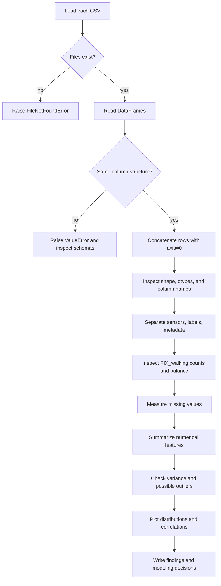

# EDA in Pandas: an engineering guide

> You wrote “ETA.” The usual term here is **EDA: exploratory data analysis**.

This guide is for the ExtraSensory assignment. It is also meant to become a
general way of thinking about data work. Do not try to memorize every method.
Learn what question each method answers, what object it returns, and how to
check that the result makes sense.

The code examples use tiny toy data so you can run them without the full
dataset. The assignment tasks are written as hints and skeletons. You write
those parts in the notebook.

## 1. What EDA is

EDA is the first investigation of a dataset before preprocessing and model
training. We are trying to answer questions such as:

- What does one row represent?
- Which columns are measurements, labels, identifiers, or metadata?
- Which values are missing or impossible?
- Is the target balanced?
- Are some features constant, noisy, or on very different scales?
- Which patterns are worth testing with a model?

EDA is not just making plots. It is a chain of checks. A useful loop is:

```text
Question → pandas object → operation → expected result → validation
```

Example:

```text
How many columns are numeric?
→ DataFrame
→ select_dtypes(include="number")
→ DataFrame with selected columns
→ shape[1] is the count
→ inspect a few names and dtypes
```

If you cannot say what result you expect before running a line, pause and
write a tiny example first.

## 2. The ExtraSensory data we are using

The assignment describes data from about 60 participants. You currently have
two participant files:

- `user1.features_labels.csv`
- `user2.features_labels.csv`

Each row is a short sensor window. The columns contain engineered summaries
from phone and watch sensors, plus context labels and metadata.

Your current run produced:

| File or table | Rows | Columns |
|---|---:|---:|
| user 1 | 2,685 | 278 |
| user 2 | 8,845 | 278 |
| combined table | 11,530 | 278 |

These two files are a working subset. They do not represent all participants.
For a final result, confirm which participant files your instructor expects.

Important column families include:

- `raw_acc:...`, `proc_gyro:...`, `raw_magnet:...`: sensor measurements
- `watch_acceleration:...`, `watch_heading:...`: watch measurements
- `discrete:...`: binary or discrete phone-state features
- `label:...`: context labels
- `timestamp`: time metadata
- `label_source`: label metadata

The target is exactly:

```python
TARGET = "label:FIX_walking"
```

The other `label:` columns must not become predictive features. They describe
the context that the model is supposed to predict and would leak the answer.
The timestamp and label source also need a deliberate decision before
modeling; they are metadata, not ordinary sensor measurements.

### Why `axis=0` and not `merge()`?

`pd.concat(..., axis=0)` stacks rows. Both participant files have the same
columns, so this is the operation we want:

```text
user 1 rows
user 2 rows
       ↓
one taller table with the same columns
```

`merge()` joins columns from two tables by matching key values, such as a
`user_id` or timestamp. It is for relational joins. Here, matching rows from
two people by timestamp would be meaningless and could create missing values
or many-to-many duplicates.

`axis=0` means “operate down the row axis.” In concatenation, it means add
rows. `axis=1` would place columns side by side and would require the rows to
line up correctly.

## 3. EDA flowchart



The important part is the order. We validate the table before drawing
conclusions from it.

## 4. Imports and small setup

For the EDA section, these are the usual imports:

```python
from pathlib import Path

import pandas as pd
import matplotlib.pyplot as plt
import seaborn as sns
```

`seaborn` is only needed for the heatmap. If it is not installed, install it
in your own environment or use Matplotlib for the required plots.

Use one target constant instead of repeating a long string:

```python
TARGET = "label:FIX_walking"
```

## 5. Function cards: loading and validating data

### `Path.exists`

**Purpose:** Check whether a file or directory is present before opening it.

**Syntax:**

```python
Path("file_name.csv").exists()
```

**Arguments:** The path string or path-like value.

**Returns:** `True` or `False`.

**Tiny example:**

```python
Path("notes.txt").exists()
```

**Assignment use:** Check that each downloaded CSV is in the directory where
the notebook is running.

**Common error:** A correct file exists, but the notebook's current working
directory is different from the folder you expect.

**Task:** Write a check for `user1.features_labels.csv` and print the result.

### `raise FileNotFoundError`

**Purpose:** Stop early when a required input file is missing. Continuing would
produce an invalid analysis.

**Syntax:**

```python
raise FileNotFoundError("message explaining the missing file")
```

**Arguments:** A useful message; include the path you checked.

**Returns:** Nothing. It interrupts the current execution with an exception.

**Tiny example:**

```python
path = Path("scores.csv")
if not path.exists():
    raise FileNotFoundError(f"Could not find {path}")
```

**Assignment use:** Fail clearly instead of letting `pd.read_csv` fail later
with a less contextual path error.

**Common error:** Raising the exception unconditionally because the `if`
indentation is wrong.

**Task:** Add the same check for the second participant file.

### `pd.read_csv`

**Purpose:** Read a CSV file into a pandas `DataFrame`.

**Syntax:**

```python
pd.read_csv(filepath, **options)
```

**Relevant arguments:**

- `filepath`: file path or URL
- `sep`: delimiter, usually `","`
- `na_values`: extra strings that should become missing values

**Returns:** A `DataFrame`.

**Tiny example:**

```python
toy = pd.read_csv("toy.csv")
```

**Assignment use:** Load each participant file into its own table before
checking that their schemas match.

**Common error:** `FileNotFoundError`, or reading a file from the wrong
working directory.

**Task:** Load both files into `df1` and `df2`, then check their shapes.

### `DataFrame.columns.equals`

**Purpose:** Check whether two column indexes contain the same labels in the
same order.

**Syntax:**

```python
df1.columns.equals(df2.columns)
```

**Arguments:** The other `Index` to compare.

**Returns:** A boolean.

**Tiny example:**

```python
a = pd.DataFrame({"x": [1], "y": [2]})
b = pd.DataFrame({"x": [3], "y": [4]})
a.columns.equals(b.columns)  # True
```

**Assignment use:** Confirm that row concatenation will line up the same
features in both files.

**Common error:** Checking only the number of columns. Two tables can have 278
columns with different names or order.

**Task:** Write the condition that allows concatenation only when the result
is `True`.

### `pd.concat`

**Purpose:** Combine pandas objects along an axis.

**Syntax:**

```python
pd.concat([df1, df2], axis=0, ignore_index=True)
```

**Relevant arguments:**

- list of objects to combine
- `axis=0`: stack rows
- `ignore_index=True`: create a fresh row index

**Returns:** A new `DataFrame`.

**Tiny example:**

```python
a = pd.DataFrame({"x": [1, 2]})
b = pd.DataFrame({"x": [3]})
pd.concat([a, b], axis=0, ignore_index=True)
```

**Assignment use:** Build the current 11,530-row practice table from the two
participant tables.

**Common error:** Using `axis=1` and accidentally placing different people in
the same row, or concatenating mismatched schemas without checking them.

**Task:** Concatenate only after your column check passes, then verify the
combined row count.

### `raise ValueError`

**Purpose:** Stop when the data violates an assumption that makes the next
operation unsafe.

**Syntax:**

```python
raise ValueError("message explaining the invalid value or structure")
```

**Arguments:** A message that says what assumption failed.

**Returns:** Nothing. It interrupts execution.

**Tiny example:**

```python
if not {"x", "y"}.issubset({"x"}):
    raise ValueError("Required columns are missing")
```

**Assignment use:** Raise an error when participant files have different
column names or ordering. Say “column structure differs,” not merely “column
numbers differ.”

**Common error:** Raising `ValueError` for a missing file; that situation is a
`FileNotFoundError`.

**Task:** Improve the error message in your notebook.

## 6. Function cards: understanding the table

### `DataFrame.shape`

**Purpose:** Get the table dimensions.

**Syntax:**

```python
df.shape
df.shape[0]  # rows
df.shape[1]  # columns
```

**Arguments:** None. It is a property, so do not add parentheses.

**Returns:** A tuple `(number_of_rows, number_of_columns)`.

**Tiny example:**

```python
pd.DataFrame({"x": [1, 2], "y": [3, 4]}).shape  # (2, 2)
```

**Assignment use:** Answer Q2.1 and check that concatenation added rows but
did not change the 278-column schema.

**Common error:** Writing `df.shape()`; that gives a `TypeError` because
`shape` is not a function.

**Task:** Print the row and column counts for `df1`, `df2`, and `df`.

### `DataFrame.columns`

**Purpose:** Access column labels.

**Syntax:**

```python
df.columns
```

**Arguments:** None.

**Returns:** A pandas `Index` of column names.

**Tiny example:**

```python
toy = pd.DataFrame({"height": [170], "weight": [65]})
toy.columns
```

**Assignment use:** Find names beginning with `label:` or `discrete:` and
verify that `TARGET` exists.

**Common error:** Treating the `Index` as a regular list when you need a
boolean mask or string operation.

**Task:** Print the first five and last five column names.

### `DataFrame.dtypes`

**Purpose:** Inspect the data type of every column.

**Syntax:**

```python
df.dtypes
```

**Arguments:** None.

**Returns:** A pandas `Series` indexed by column name.

**Tiny example:**

```python
pd.DataFrame({"name": ["A"], "age": [20]}).dtypes
```

**Assignment use:** Answer Q2.2 and check whether a column was read as text
when it should be numeric.

**Common error:** Assuming every numeric dtype is a valid model feature.
`timestamp`, labels, and metadata can also be stored as numbers.

**Task:** Inspect `df.dtypes.value_counts()` and then inspect a few named
columns directly.

### `DataFrame.info`

**Purpose:** Print a compact structural summary, including non-null counts and
memory use.

**Syntax:**

```python
df.info()
```

**Arguments:** Optional display settings such as `show_counts=True`.

**Returns:** `None`; it prints the summary.

**Tiny example:**

```python
toy = pd.DataFrame({"x": [1, None], "y": [2, 3]})
toy.info()
```

**Assignment use:** Quickly see the table size and whether columns have
missing observations before detailed Q2.9 calculations.

**Common error:** Trying to assign the result to a new table. The useful
information is printed, not returned.

**Task:** Run `df.info()` once and compare its non-null counts with your
missing-value calculation later.

### `DataFrame.select_dtypes`

**Purpose:** Select columns based on their pandas dtype.

**Syntax:**

```python
df.select_dtypes(include="number")
```

**Arguments:** `include` keeps types in a category such as `"number"`;
`exclude` removes types.

**Returns:** A new `DataFrame` containing the selected columns.

**Tiny example:**

```python
toy = pd.DataFrame({"age": [20], "name": ["A"]})
toy.select_dtypes(include="number")
```

**Assignment use:** Answer Q2.3 and create a starting set of numerical
columns. Remove target and metadata columns before modeling.

**Common error:** Calling the result “model features” without checking for
labels, timestamps, or discrete metadata.

**Task:** Count the selected columns using `.shape[1]` and inspect a few names.

## 7. Function cards: grouping columns and categories

### `Index.str.startswith`

**Purpose:** Build a boolean mask for labels that begin with a prefix.

**Syntax:**

```python
df.columns.str.startswith("label:")
```

**Arguments:** The prefix string; `na` can control missing labels when using a
regular string series.

**Returns:** A boolean array or boolean `Index` mask.

**Tiny example:**

```python
names = pd.Index(["label:a", "raw_acc:x"])
names[names.str.startswith("label:")]
```

**Assignment use:** Identify the 51 context-label columns and the 34
`discrete:` columns for Q2.4.

**Common error:** Leaving out the colon. `"label"` may also match names that
do not use the dataset's `label:` naming convention.

**Task:** Create `label_cols` and `discrete_cols`, then print their lengths.

### `Index.to_series`

**Purpose:** Convert an `Index` into a `Series` so normal Series string and
counting methods can be chained.

**Syntax:**

```python
df.columns.to_series()
```

**Arguments:** None for this use.

**Returns:** A pandas `Series` containing the column labels.

**Tiny example:**

```python
pd.Index(["a:x", "b:y"]).to_series()
```

**Assignment use:** Prepare column names for `str.split` and
`value_counts` when answering Q2.5.

**Common error:** Calling `.str` directly on a DataFrame instead of on its
column index or a Series of names.

**Task:** Turn `df.columns` into a Series and inspect its first three values.

### `Series.str.split`

**Purpose:** Split each string into pieces.

**Syntax:**

```python
names.str.split(":", n=1)
```

**Arguments:** `":"` is the separator; `n=1` makes only one split.

**Returns:** A Series of lists (or, with expansion, multiple columns).

**Tiny example:**

```python
pd.Series(["raw_acc:mean", "label:walk"]).str.split(":", n=1)
```

**Assignment use:** Get the category before the first colon, such as
`raw_acc`, `label`, or `discrete`.

**Common error:** Splitting without `n=1` and assuming every feature has the
same number of colon-separated parts.

**Task:** Split the column-name Series once and select the first piece.

### `Series.value_counts`

**Purpose:** Count distinct values.

**Syntax:**

```python
series.value_counts(dropna=True, normalize=False)
```

**Arguments:**

- `dropna=False` includes missing values
- `normalize=True` returns proportions instead of raw counts

**Returns:** A Series indexed by value, sorted by frequency.

**Tiny example:**

```python
pd.Series(["a", "a", "b", None]).value_counts(dropna=False)
```

**Assignment use:** Count sensor categories in Q2.5, target classes in Q2.6,
and class proportions in Q2.7.

**Common error:** Forgetting that the default drops `NaN`, which can make the
target look more complete than it is.

**Task:** First count `TARGET` with `dropna=False`; then calculate proportions
only after removing missing targets.

## 8. Function cards: missing values and target quality

### `DataFrame.isna`

**Purpose:** Mark missing cells.

**Syntax:**

```python
df.isna()
```

**Arguments:** None for the basic check.

**Returns:** A boolean `DataFrame` with the same shape as `df`.

**Tiny example:**

```python
pd.DataFrame({"x": [1, None]}).isna()
```

**Assignment use:** Start Q2.9 by finding missing observations in every
feature.

**Common error:** Expecting a single percentage. The immediate result is one
boolean value per cell.

**Task:** Store the boolean result in `missing_mask` and inspect its shape.

### `DataFrame.sum(axis=0)`

**Purpose:** Add values for each column.

**Syntax:**

```python
df.isna().sum(axis=0)
```

**Arguments:** `axis=0` computes down rows for each column. `axis=1` computes
across columns for each row.

**Returns:** A Series with one sum per column.

**Tiny example:**

```python
toy = pd.DataFrame({"a": [True, False], "b": [True, True]})
toy.sum(axis=0)
```

**Assignment use:** Count missing values for every feature in Q2.9.

**Common error:** Using `axis=1` and then interpreting row-level missingness as
column-level missingness.

**Task:** Calculate `missing_counts` and check the count for `TARGET`.

### `DataFrame.mean`

**Purpose:** Calculate the arithmetic mean, normally down each column.

**Syntax:**

```python
df.mean(axis=0, skipna=True)
```

**Arguments:** `axis=0` means one mean per column; `skipna=True` ignores
missing values.

**Returns:** A Series of means, or a scalar for a Series.

**Tiny example:**

```python
pd.Series([2, 4, None]).mean()
```

**Assignment use:** Calculate the missing fraction as
`df.isna().mean(axis=0)` or calculate feature means in Q2.10.

**Common error:** Treating the mean of a label column as a full class
distribution when missing targets are present.

**Task:** Calculate missing percentages and compare one result with your
manual formula.

### `Series.dropna`

**Purpose:** Remove missing values from a Series.

**Syntax:**

```python
series.dropna()
```

**Arguments:** `inplace=False` is the safe default; `how` is more common on a
DataFrame.

**Returns:** A new Series without missing values.

**Tiny example:**

```python
pd.Series([0, None, 1]).dropna()
```

**Assignment use:** Calculate class percentages using only rows with a known
`FIX_walking` target. Report target missingness separately.

**Common error:** Calling `dropna` on the full table just to calculate target
balance and silently removing useful sensor rows from later analysis.

**Task:** Create `labeled_target = target.dropna()` and check its length.

### `DataFrame.nunique`

**Purpose:** Count distinct values in each column.

**Syntax:**

```python
df.nunique(dropna=True)
```

**Arguments:** `dropna=False` includes missing values as a distinct value.

**Returns:** A Series with one distinct-value count per column.

**Tiny example:**

```python
pd.DataFrame({"a": [1, 1, 2], "b": [None, None, 3]}).nunique()
```

**Assignment use:** Find zero-variance columns and support near-zero-variance
screening in Q2.10.

**Common error:** Confusing a small number of unique values with a useless
feature. A binary feature can still be predictive.

**Task:** Find columns whose non-missing unique count is one.

## 9. Function cards: numerical summaries and relationships

### `DataFrame.describe`

**Purpose:** Produce common summary statistics for numerical columns.

**Syntax:**

```python
df.describe()
```

**Arguments:** `include="number"` selects numeric types; `percentiles` can
request additional percentiles.

**Returns:** A `DataFrame` whose rows are statistics and columns are features.

**Tiny example:**

```python
pd.DataFrame({"x": [1, 2, 3]}).describe()
```

**Assignment use:** Answer the calculation part of Q2.10. The output includes
`count`, `mean`, `std`, `min`, `25%`, `50%`, `75%`, and `max`.

**Common error:** Comparing standard deviations across features with unrelated
units and calling the largest one “best.”

**Task:** Transpose the result with `.T`, rename `50%` to `median`, and add an
IQR column.

### `DataFrame.quantile`

**Purpose:** Get a value below which a chosen fraction of observations falls.

**Syntax:**

```python
df.quantile(0.25)
```

**Arguments:** `0.25` is the first quartile; `0.75` is the third quartile.

**Returns:** A Series of quantiles for each column, or a DataFrame for a list
of probabilities.

**Tiny example:**

```python
pd.DataFrame({"x": [1, 2, 3, 4]}).quantile(0.75)
```

**Assignment use:** Calculate `Q1`, `Q3`, and `IQR = Q3 - Q1` for possible
outlier screening in Q2.10.

**Common error:** Treating the 75th percentile as the maximum. It is only the
value above 75% of the observations.

**Task:** Write the lower and upper IQR bounds without deleting any rows yet.

### `DataFrame.corr`

**Purpose:** Measure pairwise linear correlation between numerical columns.

**Syntax:**

```python
df.corr(numeric_only=True)
```

**Arguments:** `numeric_only=True` restricts the operation to numeric columns;
`method` can be `"pearson"`, `"spearman"`, or `"kendall"`.

**Returns:** A square correlation `DataFrame` with values from -1 to 1.

**Tiny example:**

```python
toy = pd.DataFrame({"x": [1, 2, 3], "y": [2, 4, 6]})
toy.corr()
```

**Assignment use:** For Q3.1, inspect correlations between candidate features
and `TARGET`, then rank the absolute target correlations to find five
candidates.

**Common error:** Treating correlation as proof of causation, or calculating
it with context-label columns that leak the answer.

**Task:** Build a correlation table using labeled rows and remove the target
column from the feature ranking before selecting the top five names.

### `Series.plot`

**Purpose:** Create a quick pandas plot from a Series.

**Syntax:**

```python
series.plot(kind="bar", title="...")
```

**Arguments:** `kind="bar"` for counts, `kind="hist"` for a distribution;
`title` labels the chart.

**Returns:** A Matplotlib `Axes` object.

**Tiny example:**

```python
pd.Series([3, 1], index=["yes", "no"]).plot(kind="bar")
```

**Assignment use:** Plot the counts of `FIX_walking = 0` and `1` for Q2.6.

**Common error:** Plotting the target with missing values included and then
calling the missing bar a third class without explaining it.

**Task:** Plot `target.value_counts(dropna=False)` and label the plot.

### `plt.show`

**Purpose:** Display the current Matplotlib figure.

**Syntax:**

```python
plt.show()
```

**Arguments:** None for notebook use.

**Returns:** Usually `None`.

**Tiny example:**

```python
pd.Series([1, 2, 3]).plot()
plt.show()
```

**Assignment use:** Make sure plots render in the notebook output.

**Common error:** Creating many figures in a loop without closing them or
using a title and axis labels.

**Task:** Add a title and call `plt.show()` after your target plot.

### `sns.heatmap`

**Purpose:** Display a matrix as colored cells; useful for correlations.

**Syntax:**

```python
sns.heatmap(correlation_table, annot=False, cmap="coolwarm")
```

**Arguments:** The matrix; `annot=True` writes values into cells;
`cmap` chooses colors.

**Returns:** A Matplotlib `Axes` object.

**Tiny example:**

```python
toy_corr = pd.DataFrame([[1.0, 0.5], [0.5, 1.0]], columns=["x", "y"], index=["x", "y"])
sns.heatmap(toy_corr, annot=True, cmap="coolwarm")
```

**Assignment use:** Visualize a manageable correlation matrix and support
Q3.1. A heatmap of all 278 columns will be unreadable, so select relevant
columns or show a focused top-five table.

**Common error:** Forgetting that the diagonal is always 1.0 because each
feature is perfectly correlated with itself.

**Task:** Create a heatmap for the target and your five strongest candidate
features.

## 10. How to reason through Q2.1–Q2.10

The assignment asks for a result, but an engineer also records why the result
matters.

### Q2.1 and Q2.2: shape and types

**Question:** What table did we load?

**Reasoning:** Start with the object itself. `shape` answers dimensions;
`dtypes` answers how pandas interpreted each column.

**Toy check:** Make a two-row, two-column DataFrame and predict its shape.

**Assignment skeleton:**

```python
# TODO: print rows and columns for each file and for the combined table.
print(df1.shape)
print(df2.shape)
print(df.shape)
```

**Expected result:** Each source table has 278 columns; the combined table has
the sum of the rows.

**What-if:** If one file has one extra column, the schema check should stop the
pipeline before concatenation.

**Debug prompt:** If the shape is wrong, check which variable was last
assigned and whether the notebook ran cells in order.

### Q2.3 and Q2.4: numeric, discrete, and label columns

**Question:** Which columns are numeric, and which names tell us their role?

**Reasoning:** Dtype answers how values are stored. Prefixes answer what the
dataset creators say the columns represent. We need both.

**Toy check:** On `Index(["label:x", "discrete:y", "raw_acc:z"])`, predict the
length of each prefix mask.

**Assignment skeleton:**

```python
numeric_df = df.select_dtypes(include="number")
# TODO: create label_cols and discrete_cols from df.columns.
```

**Expected result:** In the current files, all 278 columns are numeric dtype,
but only some are candidate measurements. There are 51 label columns and 34
discrete columns.

**What-if:** If labels were stored as strings, `select_dtypes("number")` would
not find them, but the prefix check would still find their names.

**Debug prompt:** Print the first five selected names before trusting the
count.

### Q2.5: sensor categories

**Question:** What sensor families are represented?

**Reasoning:** The part before the first colon is a category. Split names,
select the first part, and count it.

**Assignment skeleton:**

```python
names = df.columns.to_series()
# TODO: split once at ':' and count the first piece.
```

**Expected result:** Categories include `raw_acc`, `proc_gyro`, `raw_magnet`,
`watch_acceleration`, `label`, and `discrete`.

**What-if:** If a column has no colon, the first piece is the entire name. Do
not assume every category has identical feature naming.

**Debug prompt:** Inspect the split result for `timestamp` and
`label_source`.

### Q2.6–Q2.8: target counts, percentages, and balance

**Question:** How often is the participant walking, and can a model learn the
minority class?

**Reasoning:** Count the target first. Missing targets are not class 0 or
class 1, so report them separately. Calculate class percentages only from
labeled rows.

**Assignment skeleton:**

```python
target = df[TARGET]
counts = target.value_counts(dropna=False)
labeled_target = target.dropna()
# TODO: calculate normalized class proportions from labeled_target.
```

**Expected result:** Your current run had 7,862 zeros, 322 ones, and 3,346
missing targets. Among labeled rows, the proportions were about 96.1% zero and
3.9% one. That is strongly imbalanced.

**What-if:** If you included missing values in the denominator, the class
percentages would describe data completeness and class balance at the same
time. Those are different questions.

**Debug prompt:** Check whether your normalized counts add to 1.0. If not,
look for missing targets or a filtering mistake.

### Q2.9: missingness

**Question:** Which features are incomplete?

**Reasoning:** `isna()` makes a cell-level mask. `sum(axis=0)` turns it into a
count per column. Divide by the number of rows to get a percentage.

**Assignment skeleton:**

```python
missing_counts = df.isna().sum(axis=0)
# TODO: calculate one missing percentage for each column.
# TODO: filter percentages above 50 and 80.
```

**Expected result:** A Series indexed by column name, plus two filtered
Series for the requested thresholds.

**What-if:** A column can be 60% missing overall but nearly complete for the
walking rows. Check whether missingness itself is related to the target before
choosing a removal or imputation rule.

**Debug prompt:** Confirm that the percentage denominator is `df.shape[0]`,
not the number of columns.

### Q2.10: numerical summaries and feature quality

**Question:** What are the typical values, spread, and suspicious patterns in
the numerical columns?

**Reasoning:** Use `describe()` for the requested statistics. Use standard
deviation to rank spread, IQR to flag possible outliers, and `nunique()` plus
dominant-value share to screen constant or nearly constant features.

**Assignment skeleton:**

```python
# Start from numeric_df, then remove labels and metadata from model candidates.
# TODO: create a transposed describe() table with an IQR column.
# TODO: rank or threshold standard deviation and inspect the top results.
# TODO: calculate IQR bounds without deleting rows automatically.
# TODO: identify zero- and near-zero-variance columns.
```

**Expected result:** A summary row for every numerical candidate feature, plus
lists or tables for the requested quality checks.

**What-if:** A large standard deviation may only mean that a feature uses
larger units. Standardize or compare within a sensor family before deciding it
is useful.

**Debug prompt:** Check whether the summary includes `TARGET`, timestamps, or
other labels. If it does, your feature-selection boundary is wrong.

## 11. Q3.1: correlation without fooling yourself

Correlation is a screening tool, not a final feature-selection proof.

Use labeled rows when correlating with the target. Remove all context labels
except the target before modeling. Rank by absolute correlation because both a
strong positive and a strong negative relationship can matter:

```python
abs_corr = correlation_table[TARGET].abs().sort_values(ascending=False)
```

Do not use `TARGET` itself as one of the selected features. Do not use another
`label:` column just because it has a high correlation; that would leak context
information into the model.

For a readable plot, select the target and a small number of candidate columns
instead of drawing a 278-by-278 heatmap.

## 12. Engineering guardrails

### Numeric does not mean usable

`timestamp`, labels, and some metadata are numeric because they are stored as
numbers. That does not make them valid predictors. A feature must be available
at prediction time and must not contain the answer.

### Missing values need a reason

Do not automatically delete every column above a threshold. Ask why it is
missing, whether the sensor is unavailable, and whether the pattern changes by
participant or target. The assignment asks you to identify high-missingness
columns; the modeling pipeline later decides what to do with them.

### Outliers are a flag, not a verdict

The IQR rule identifies unusual values. An unusual sensor reading can be a
real movement, a device difference, or a recording error. Inspect it before
clipping or deleting it.

### Correlation is not causation

A high correlation can come from a shared time pattern, leakage, or a third
factor. Treat it as a candidate relationship to test with a proper split.

### Participant identity matters

Rows from one participant are related. For a serious evaluation, consider a
participant-aware split so that the model is tested on people it did not see
during training. Do not claim that a random row split measures generalization
to new people.

## 13. How to build logic when you are stuck

### For syntax problems

1. Name the object and its type: `df` is a `DataFrame`, `target` is a
   `Series`, and `df.columns` is an `Index`.
2. Use autocomplete or `help`:

```python
help(pd.DataFrame.select_dtypes)
help(pd.Series.value_counts)
```

3. Search the official documentation with the operation and desired result,
   for example: `pandas count missing values per column`.
4. Try the call on three rows before applying it to 11,530 rows.

### For logic problems

Write these four lines before coding:

```text
Input: what object and columns do I have?
Question: what exactly am I trying to know?
Expected output: what type, shape, or range should come back?
Check: how will I know the result is believable?
```

Then write pseudocode. For example:

```text
make a missing-value mask
count True values down each column
divide by row count
keep percentages above each requested threshold
```

Change one thing at a time. If you have been stuck for about 15–20 minutes,
ask for a targeted hint with this format:

> I am trying to ___. My input is ___. I expected ___ but got ___. I tried
> ___. Give me one hint first.

### For error messages

- Read the exception type and the traceback line.
- Print `type(value)`, `value.shape`, or a small sample.
- Reduce the failing case to three rows and two columns.
- Test one hypothesis, then rerun.

After the fix, state the cause in one sentence and solve a small variation.
That second step is what turns a fix into a skill.

## 14. A small reusable EDA pattern

This is a design pattern to understand, not a replacement for your assignment
work:

```python
TARGET = "label:FIX_walking"

# 1. Load and validate inputs.
# 2. Combine rows only after schema checks.
# 3. Inspect shape, types, and column families.
# 4. Separate target, labels, metadata, and candidate features.
# 5. Measure target balance and missingness.
# 6. Summarize distributions and quality flags.
# 7. Plot focused relationships.
# 8. Record decisions and evidence.
```

Keep these stages in separate notebook cells. If a later cell depends on a
variable, make that dependency obvious rather than hiding the whole analysis
inside one giant cell.

## 15. EDA report checklist

Before moving to preprocessing, your notebook should answer:

- [ ] How many rows and columns are in each input and in the combined table?
- [ ] What are the dtypes, and are any surprising?
- [ ] How many numeric, discrete, label, and sensor-category columns exist?
- [ ] Is `label:FIX_walking` present and spelled exactly?
- [ ] What are the class counts and labeled class percentages?
- [ ] What percentage of the target is missing?
- [ ] Is the target imbalanced, and what does that change in evaluation?
- [ ] Which columns exceed 50% and 80% missingness?
- [ ] What are the numerical summaries for candidate features?
- [ ] Which features have high spread, possible outliers, or near-zero variance?
- [ ] What five correlations are worth investigating for Q3.1?
- [ ] Which columns are excluded because of leakage or metadata?
- [ ] Did you record the assumptions behind every filtering decision?

Finish by explaining one finding without looking at the code, predicting what
would change if one condition changed, and implementing a small variation.
