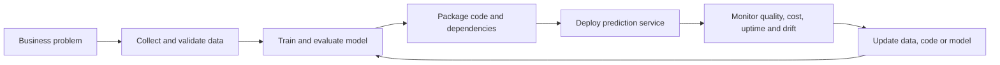
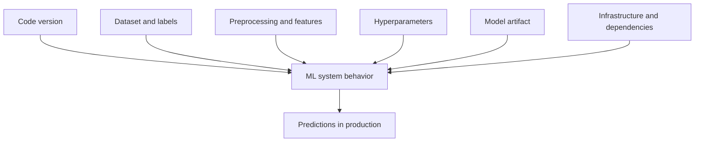
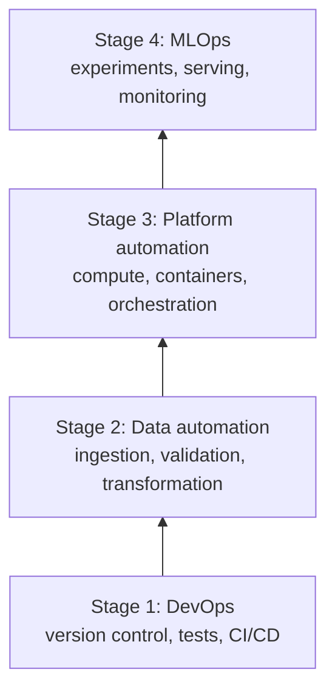
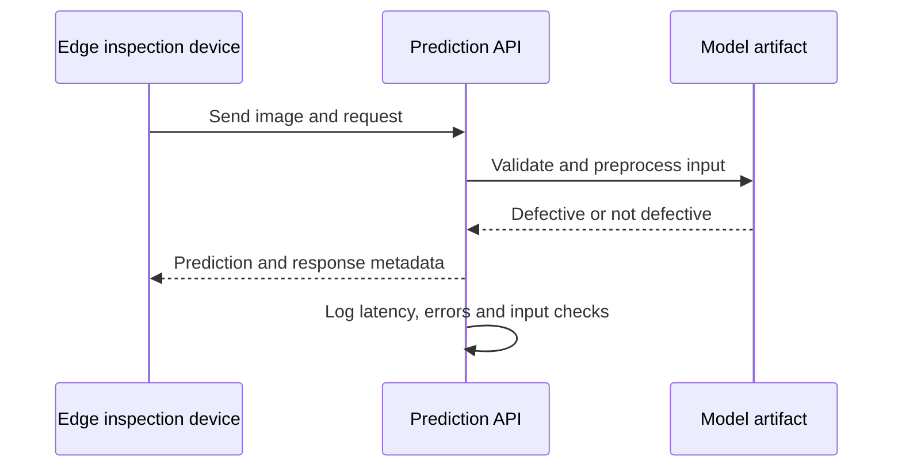
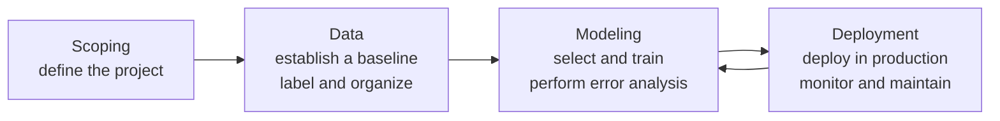
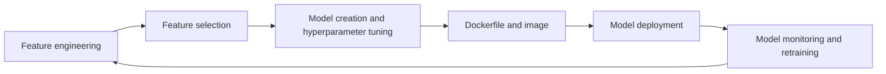

# Lecture 1: Machine Learning Operations (MLOps)

Source: [Lecture 1 - MLOps Introduction](Lecture%201_%20MLOps%20Introduction%20%281%29.pdf)

This is a complete study guide for the 28-slide lecture. Read the explanation first, pause at each **What if?** question, predict an outcome, and then compare your prediction with the analysis.

## 1. The central idea

Machine learning operations, or MLOps, is the engineering discipline of taking a machine learning system from an experiment to a reliable product. It combines software engineering, data engineering, infrastructure, and machine learning practices.

The important unit is not just a trained model. It is the complete system around that model:



In a notebook, you may prove that a model can predict a label. In production, you must also answer:

- Where does new input arrive from?
- Which exact preprocessing and model version produce the prediction?
- How is the service deployed and scaled?
- What happens when data, hardware, or the network fails?
- How do we know that predictions still work after deployment?
- Can another engineer reproduce the result?

The lecture's phrase "If it is not automated, it is broken" is a useful provocation, not a literal law. Some manual decisions are necessary. The engineering goal is to automate repeatable work and make unavoidable manual decisions explicit, reviewable, and safe.

## 2. What an ML engineer does

The lecture presents an ML engineer as someone who designs, builds, and productionizes models to solve business problems. That means the role includes model code, data handling, deployment, infrastructure, testing, monitoring, and maintenance.

### Model quality is only one part of success

The lecture identifies two high-level measures:

1. How many useful ML models actually reach production.
2. What impact those models have on business return on investment (ROI).

It also names cost, uptime, and the staff required to maintain the system as important signals.

For example, consider a factory that photographs smartphones and asks a model whether each phone is defective. A model with excellent offline accuracy may still fail as a product if it is too slow for the assembly line, too expensive to run, or unavailable during a network outage.

A practical production scorecard might include:

| Dimension | Question |
|---|---|
| Predictive quality | Are the predictions correct for the cases that matter? |
| Latency | How long does one prediction take? |
| Throughput | How many predictions can the system handle per second? |
| Availability | Is the service reachable when needed? |
| Cost | What does each prediction or each operating day cost? |
| Maintainability | Can the team diagnose and update it safely? |
| Business impact | Does it reduce waste, increase revenue, or save time? |

**What if?** Model A has 99% accuracy and 30-second latency. Model B has 95% accuracy and 100-millisecond latency. Which one is better?

**Analysis:** There is no universal answer. We need the cost of false positives and false negatives, the factory's time requirement, expected traffic, and the business value of speed. The correct decision is based on the service's requirements, not on accuracy alone.

## 3. DevOps foundations

DevOps is a set of technical and organizational practices for releasing high-quality software with greater speed, reliability, scale, and security. MLOps extends these ideas to systems whose behavior also depends on data and trained models.

The lecture introduces three DevOps ideas.

### Continuous Integration (CI)

Continuous Integration means merging small code changes into a shared repository frequently and validating them automatically. A CI pipeline may:

1. Install the declared dependencies.
2. Check formatting or syntax.
3. Run unit and data tests.
4. Build a package or container.
5. Report the result to the team.

The point is to detect problems near the change that caused them. CI does not mean that every change is automatically released to users. It means the change is checked consistently.

Tools named in the lecture include GitHub Actions, Jenkins, GitLab, CircleCI, and AWS CodeBuild.

### Continuous Delivery (CD)

Continuous Delivery automates the steps needed to release validated software to an environment such as testing, staging, or production. A team can then deploy a validated change when it chooses. Some organizations add automatic production release; that stronger practice is often called continuous deployment.

CD commonly uses Infrastructure as Code (IaC). IaC represents infrastructure configuration in version-controlled files so environments can be recreated and reviewed rather than configured by undocumented clicks.

### Microservices

Microservices split an application into small, independently deployable services that communicate over a network. An e-commerce system might separate product catalog, authentication, cart, payment, and order management services.

Benefits include independent deployment and the ability to use different technologies for different services. Costs include network failures, distributed debugging, deployment coordination, monitoring complexity, and more operational overhead. A small ML project does not automatically need microservices.

### Function as a Service (FaaS)

With FaaS, a cloud provider runs a function in response to an event and manages much of the underlying infrastructure and scaling. The lecture gives AWS Lambda and an image-resizing function as examples.

FaaS can be useful for short, event-driven tasks. Cold-start latency, execution limits, vendor coupling, and unsuitable workloads are tradeoffs to examine.

### Container as a Service (CaaS)

CaaS is a managed service for deploying, running, scaling, and monitoring containers without managing every underlying server. Docker creates and runs containers; it is not itself the complete definition of CaaS. Cloud container services provide the managed layer around containers.

## 4. Why MLOps needs more than DevOps

Traditional software is mostly determined by source code. An ML system is determined by several changing inputs:



Changing any of these can change predictions. Therefore, reproducibility requires more than putting a Python script in Git. We need to identify data versions, preprocessing rules, model artifacts, dependencies, configuration, and the environment in which they run.

## 5. MLOps hierarchy of needs

The lecture presents four layers:



The layers are a useful dependency model. A team can use a model-tracking tool while still having weak engineering foundations, but the system becomes difficult to trust and maintain. The order below describes the purpose of each layer.

### Stage 1: DevOps

The lecture's DevOps project scaffold contains:

- A GitHub repository checkout.
- A `Makefile` for repeatable commands.
- A dependency file such as `requirements.txt`.
- Application code such as `hello.py`.
- Tests such as `test_hello.py`.
- A virtual environment for isolated dependencies.

The purpose is to make a fresh checkout understandable and runnable by another person or an automated system.

The lecture's sample `Makefile` has commands for installation, linting, and testing:

```make
install:
    pip install --upgrade pip
    pip install -r requirements.txt

lint:
    pylint --disable=R,C hello.py

test:
    python -m pytest -vv --cov=hello test_hello.py
```

The exact command syntax depends on the project and operating system. The engineering idea is more important: one named command should perform a repeatable action.

The example dependency file contains:

```text
pylint>=3.0.0
pytest
pytest-cov>=4.1.0
```

Version constraints make the environment more predictable. A fully reproducible project may additionally pin exact versions and record the Python version.

**What if?** Two teammates run the same notebook but have different versions of pandas or scikit-learn.

**Analysis:** They may see different warnings, defaults, errors, or model results. Declared dependencies and an isolated environment make the difference visible and easier to reproduce. They do not guarantee identical results by themselves; random seeds, hardware, data order, and library behavior may also matter.

### Stage 2: Data automation

The slides call this layer "Data Augmentation." The description is actually mostly data automation and data engineering: ingesting, cleaning, transforming, validating, versioning, and storing data reliably. In ML terminology, data augmentation usually means creating additional training examples through transformations such as image crops or noise injection. We will use the more precise distinction.

The data layer matters because an ML model can only learn from the data it receives, and production data may be incomplete, late, duplicated, malformed, or distributed differently from training data.

Tools listed in the lecture include:

| Task | Example tools |
|---|---|
| Data ingestion | Airbyte, Kafka, Fivetran |
| Batch processing | Spark, Pandas, PySpark |
| Workflow orchestration | Airflow, Dagster, Prefect |
| Streaming | Kafka, Spark Streaming |
| Data validation | Great Expectations, Soda |
| Data versioning | DVC |
| Data lake | Amazon S3, Azure Data Lake, Google Cloud Storage |
| Data warehouse | Snowflake, BigQuery, Redshift |
| Feature store | Feast |
| Transformation | dbt |

In the Week 1 ExtraSensory assignment, this layer appears when we inspect sensor columns, calculate missingness, clean the input, choose features, and make the process reproducible.

**What if?** The walking classifier was trained when the phone and smartwatch both reported data, but the smartwatch stops sending accelerometer values.

**Analysis:** The production pipeline must detect the missing sensor, decide whether to impute, use a fallback feature set, reject the request, or route it for review. The choice depends on how much the model relies on that sensor. Silently passing an unexpected input can create unreliable predictions.

### Stage 3: Platform automation

This layer provides scalable compute for training, hyperparameter tuning, and serving. It hides or standardizes infrastructure details so the team can run workloads consistently.

The lecture names:

- Kubernetes for container orchestration.
- AWS SageMaker, Google Cloud Vertex AI, and Azure Machine Learning as managed ML platforms.
- AWS Lambda and Google Cloud Run as serverless compute examples.

Scaling has costs. More machines may reduce latency but increase cost and operational complexity. A platform decision should follow workload requirements rather than tool popularity.

### Stage 4: MLOps-specific concerns

The top layer handles concerns that are particular to ML systems:

- Experiment tracking and model versioning with MLflow or DagsHub.
- Model serving and APIs with Flask, FastAPI, or Hugging Face.
- Automated pipelines, with DVC listed in the lecture as a pipeline-related tool.
- Observability, drift detection, and continuous monitoring, with Grafana listed for visualization and monitoring.

DVC is best understood primarily as a data and model versioning tool that can also define reproducible stages and pipelines. A workflow orchestrator such as Airflow addresses scheduling and operational coordination at a different level.

## 6. ML in deployment: phone inspection example

The lecture's deployment example has an edge device with a camera and inspection software. The device takes a smartphone picture and sends an API request to a prediction server. The server accepts the data, runs the model, and returns a decision about whether the phone is defective.



Putting a model into this system requires more than calling `model.predict()`:

1. Package the model and its preprocessing objects.
2. Define an input contract: accepted fields, types, shapes, and units.
3. Validate requests and return understandable errors.
4. Expose an API endpoint.
5. Deploy the service and configure its resources.
6. Log useful operational information without leaking sensitive data.
7. Monitor performance and prediction quality.
8. Define a fallback when the service or network is unavailable.

**What if?** The internet connection goes down at the factory.

**Analysis:** Possible responses include local edge inference, a queue that retries later, a safe default, manual inspection, or rejecting the operation. The correct fallback must be chosen before deployment because a “try again” response may be unsafe for a production line. The fallback should also be observable so the team knows how often it is used.

## 7. Data drift and concept drift

The lecture shows a model trained on clear images and then discusses a blue or visually changed image. It labels this as “data drift or concept drift.” These are related but different ideas.

### Data drift

Data drift means the distribution of inputs changes. In notation, the distribution of `X` changes between training and production:

```text
P_production(X) != P_training(X)
```

Examples include different lighting, camera hardware, image resolution, sensor calibration, user population, or feature missingness.

### Concept drift

Concept drift means the relationship between inputs and the target changes:

```text
P_production(Y | X) != P_training(Y | X)
```

For example, a factory changes its definition of “defective,” or a new phone design makes an old visual cue unreliable.

A blue image is not automatically concept drift. It may be input distribution drift, and it may hurt performance without changing the true relationship between image and defect. We need production measurements and labels to distinguish the causes.

Useful monitoring signals include:

- Input feature distributions and missing-value rates.
- Prediction confidence and class proportions.
- Latency, errors, throughput, and resource use.
- Delayed ground-truth performance such as precision, recall, and F1.
- Drift statistics comparing a reference training window with production windows.

**What if?** The input distribution changes, but the model's labeled accuracy does not change.

**Analysis:** The drift may be harmless, the monitored sample may be too small, or labels may not have arrived yet. Drift is a warning signal, not proof of failure. The team should investigate rather than automatically retrain.

## 8. The proof-of-concept (POC) to production gap

The lecture illustrates a common imbalance: most of the project may be a surrounding system, while the model code is only a small portion. A notebook can make the model look like the whole project, but production work also includes:

- Configuration management.
- Data collection and data verification.
- Feature extraction.
- Analysis tools and process management.
- Machine resource management.
- Serving infrastructure.
- Monitoring.
- Security, access, and failure handling.

The “gap” is not evidence that the model is unimportant. It means that a model's value depends on everything required to reliably feed it, run it, and respond to its outputs.

## 9. The ML project lifecycle

The first lifecycle diagram organizes the work into four broad phases:



### Scoping

Define the problem, users, constraints, success metric, and acceptable risks. A useful scope says what decision the model supports and what happens when it is uncertain or unavailable.

### Data

Establish a data baseline, collect and organize data, verify labels, and understand quality. Ask whether each feature will actually exist at prediction time. This is where leakage can enter.

### Modeling

Select and train candidate models, evaluate them honestly, and perform error analysis. Error analysis means studying where the model fails, not only reporting one aggregate score.

### Deployment

Deploy the service, monitor it, and maintain the system. Deployment is an ongoing phase with feedback into modeling and data work.

The second lifecycle diagram adapts this to the Week 1 assignment:



For the ExtraSensory task, feature engineering and selection must happen without using information from the test set. Preprocessing objects and the selected feature names must travel with the final model so inference uses the same representation as training.

## 10. Tools in the course

The lecture maps course tools to cloud equivalents. The map is a vocabulary guide, not a requirement to use every tool at once.

| Tool | Role in the course | Example cloud equivalents from the slides |
|---|---|---|
| MLflow | Track experiments, package code, and manage model lifecycle | SageMaker Experiments, Vertex AI Experiments, Azure ML integration |
| DVC | Version datasets, large models, and data pipelines | S3 plus Lake Formation, GCS plus BigQuery, Azure Data Lake |
| GitHub | Host and review source code | CodeCommit, Cloud Source Repositories, Azure Repos |
| Docker | Package code and dependencies into portable images | ECR/ECS, Artifact Registry/Cloud Run, ACR/Container Instances |
| DagsHub | Combine Git, DVC, and hosted MLflow collaboration | SageMaker Studio, Vertex AI Workbench, Azure ML Studio |
| CI/CD pipelines | Test, build, and deploy changes automatically | CodePipeline/CodeBuild, Cloud Build, Azure Pipelines |
| Apache Airflow | Author, schedule, and monitor workflows | MWAA, Cloud Composer, Azure workflow services |
| Docker Compose | Run multiple containers locally from YAML | ECS Copilot/App Runner, multi-container Cloud Run, Container Apps |
| Hugging Face | Share and use pretrained NLP, vision, and generative models | Bedrock/JumpStart, Vertex Model Garden, Azure model catalog |
| FastAPI | Build high-performance Python REST APIs | Lambda plus API Gateway, Cloud Run, Azure Functions |
| Flask | Build lightweight Python web and model-serving APIs | Elastic Beanstalk, App Engine/Cloud Run, Azure App Service |

Choose a tool because it solves a defined problem. A smaller project may need Git, a virtual environment, tests, and a simple API before it needs Kubernetes or a full orchestration platform.

## 11. How Lecture 1 connects to the Week 1 assignment

The assignment asks for a reproducible activity-classification pipeline using the ExtraSensory dataset and the `FIX_walking` target. It requires exploratory analysis, visualization, preprocessing, feature selection, comparison of Logistic Regression, Decision Tree, Random Forest, KNN, and SVM, hyperparameter tuning, and artifact generation.

The MLOps connection is visible in each requirement:

| Assignment requirement | MLOps lesson |
|---|---|
| Inspect dimensions, types, sensors, and missingness | Data understanding and validation |
| Remove identifiers and other context labels | Define a valid prediction boundary and prevent leakage |
| Select exactly 20 features | Make the model input contract explicit |
| Compare models and record training time | Reproducible experiments and operational tradeoffs |
| Tune hyperparameters | Controlled model development |
| Save model, scaler, selected features, and hyperparameters | Versioned, deployable artifacts |
| Reload artifacts for inference | Training-serving consistency |

The assignment has two evaluation instructions that need to be reported carefully. One section says to identify the best combination with respect to accuracy; another recommends F1-score as the primary metric and accuracy, precision, recall, and ROC-AUC as supporting metrics. Until the instructor clarifies the precedence, report both and explain the final choice.

The assignment's `LabelEncoder` demonstration also needs careful interpretation. `LabelEncoder` is intended for target labels `y`; it should not normally be used to encode input feature columns `X`. If categorical input features exist, choose an appropriate feature encoder and save the fitted transformation. The general MLOps rule is correct: inference must reuse the fitted transformation from training rather than recreate mappings manually.

## 12. Key takeaways

1. An ML product is a system, not only a model.
2. Production success includes business impact, cost, latency, uptime, and maintainability.
3. CI validates changes early; CD automates validated release steps.
4. MLOps depends on reproducible code, data, preprocessing, artifacts, configuration, and infrastructure.
5. Data automation and platform automation support specialized MLOps work.
6. Deployment creates new failure modes: bad inputs, network outages, resource limits, drift, and delayed labels.
7. Data drift changes the input distribution; concept drift changes the input-to-target relationship.
8. Monitoring is part of the lifecycle because a deployed model can become less useful over time.
9. Tool choice follows the problem and operating requirements.
10. A strong engineer can explain why a model and system were built a certain way, reproduce the result, and identify what evidence would justify changing it.

## Self-check before the chat questions

Try to answer these without looking back:

1. Why can a high-accuracy model still be a poor production system?
2. What is the difference between CI and CD?
3. What information must be versioned besides the Python model code?
4. Why is “data augmentation” an imprecise label for most of the slide 15-16 data layer?
5. Give one example of data drift and one example of concept drift.
6. What should happen if a required sensor is missing at inference time?
7. Why must the fitted preprocessing object be saved with the model?
8. Which metric conflict exists in the Week 1 assignment, and how will you report it?

Bring your answers to the chat. We will check the reasoning, correct weak assumptions, and then move into the first assignment milestone.
