# Part 2 — From a DataFrame to a training pipeline

[Previous: EDA](EDA_Pandas_Engineering_Guide.md) · [Next: Models and evaluation](Week1_Part3_Models_and_Evaluation.md)

## 1. What you are learning here

You know what training a model means. The missing step is translating that idea into library calls in the right order. Start with three questions: **What object do I have? What does this call learn? What object comes back?**

This part covers Task 4.1, the preparation needed for the five models, and the boundary between the Q3.1 correlation plot and predictive feature selection. Read the concepts first. Use the function cards when you write a cell.

Code labelled **toy example** uses unrelated data. Code labelled **assignment TODO** is intentionally incomplete. You run the examples and check the outputs; this guide is an explanation, not a claim that your notebook has been executed.

```mermaid
flowchart TD
    A[Combined participant data] --> B[Keep rows with known target]
    B --> C[Separate X, y, and participant IDs]
    C --> D[80 percent training / 20 percent test]
    D --> E[Training-only cross-validation]
    E --> F[Fit imputer and selector inside each fold]
    F --> G[Scale selected inputs when needed]
    G --> H[Train and compare models]
    D --> I[Hold test set aside until final evaluation]
```



## 2. The small amount of Python you need

```python
from sklearn.preprocessing import StandardScaler

scaler = StandardScaler()
```

Read that literally:

- `from ... import ...` makes a library name available.
- `StandardScaler` is a class: a recipe for creating an object.
- `StandardScaler()` constructs one object. It has not seen data yet.
- `scaler.fit(X_train)` learns statistics and stores them inside that object.
- `scaler.transform(X_valid)` uses the stored statistics.
- `scaler.mean_` is learned state. The trailing underscore is a common scikit-learn convention.

`strategy="median"` is a **keyword argument**: the name tells you what the value controls. You do not need to memorize every optional argument. Learn the few you use, then look up the rest.

## 3. Agree on the objects before coding

| Name | Type / shape | Meaning |
|---|---|---|
| `df` | DataFrame, all loaded rows | Original working data, including unknown targets |
| `labeled_df` | DataFrame | Rows where the walking target is known |
| `X` | DataFrame, `(n_rows, n_candidates)` | Numeric candidate inputs; no labels or identifiers |
| `y` | Series, `(n_rows,)` | Walking target, values 0 and 1 |
| `groups` | Series, `(n_rows,)` | Participant IDs for later grouped evaluation |
| `X_train`, `y_train` | About 80% of labelled rows | Development data, including cross-validation |
| `X_test`, `y_test` | About 20% | Final held-out evaluation only |

Use `TARGET = "label:FIX_walking"` and `RANDOM_STATE = 42` consistently. These names are your choices; `fit`, `predict`, and constructor arguments are library-defined names.

Your earlier run had 8,184 labelled rows and 3,346 missing targets. A missing target means **unknown**, not “not walking.” Do not fill it with zero. Keep the raw table for EDA, but remove these rows from supervised training.

For Task 4.1, keep the walking target as `y` and exclude **all** `label:` columns from `X`, including the walking target itself. Also exclude `timestamp`, `label_source`, and any participant identifier. Removing other labels is an explicit assignment requirement; the identifier treatment is a modeling choice that we are documenting.

## 4. Function cards: making X and y

Imports used in this section: `import pandas as pd`.

### `DataFrame.dropna`

- **Purpose:** Remove rows whose required target is missing.
- **Syntax:** `table.dropna(subset=["answer"])`
- **Arguments:** `subset` names the columns to check. It does not mean “return only these columns.”
- **Returns:** A new DataFrame with qualifying rows and all original columns.
- **Toy example:** `pd.DataFrame({"answer": [1, None], "x": [5, 6]}).dropna(subset=["answer"])` keeps the first row.
- **Assignment use:** Build `labeled_df` using `TARGET`.
- **Common error:** Calling `df.dropna()` drops rows with any missing sensor, often throwing away far too much data.
- **Learner task:** Compare the labelled row count with the sum of the 0 and 1 target counts.

### `DataFrame.drop`

- **Purpose:** Remove named columns without manually selecting every remaining column.
- **Syntax:** `table.drop(columns=["answer", "record_id"])`
- **Arguments:** `columns` is the list to remove; the default raises an error for a nonexistent name.
- **Returns:** A new DataFrame.
- **Toy example:** `pd.DataFrame({"x": [4], "answer": [1]}).drop(columns=["answer"])` returns only `x`.
- **Assignment use:** Build `X` by excluding labels and metadata.
- **Common error:** `KeyError` from a misspelled column. Do not automatically hide it with `errors="ignore"` when the column is required.
- **Learner task:** Build the exclusion list from actual column names and inspect the remaining names.

### Column access and `.loc`

- **Purpose:** Select a Series, a DataFrame, or an explicitly ordered set of columns.
- **Syntax:** `table["answer"]`; `table[["answer"]]`; `table.loc[:, names]`
- **Arguments:** One string selects a Series; a list selects a DataFrame; `.loc[rows, columns]` uses labels.
- **Returns:** A Series or DataFrame depending on the selection.
- **Toy example:** `pd.DataFrame({"answer": [0, 1]})["answer"].shape` is `(2,)`.
- **Assignment use:** Make a one-dimensional `y`; later preserve feature order at inference.
- **Common error:** Passing `table[[TARGET]]` when a one-dimensional target is expected.
- **Learner task:** Print `type(y)` and `y.shape`, then compare with `X.shape`.

### `Series.astype`

- **Purpose:** Convert a Series to a chosen dtype.
- **Syntax:** `series.astype(int)`
- **Arguments:** The target type, here integer.
- **Returns:** A converted Series.
- **Toy example:** `pd.Series([0.0, 1.0]).astype(int)` becomes integer labels.
- **Assignment use:** Convert known, validated 0/1 target values after removing missing targets.
- **Common error:** Casting before checking the values can silently truncate an invalid value such as 0.8. Casting `NaN` to ordinary integers fails.
- **Learner task:** Verify the non-missing target contains only 0 and 1 before conversion.

### `DataFrame.assign`

- **Purpose:** Add a named column while returning a new table.
- **Syntax:** `table.assign(participant_id="person_a")`
- **Arguments:** Keyword names become columns; a scalar is repeated for every row.
- **Returns:** A new DataFrame.
- **Toy example:** `pd.DataFrame({"x": [1, 2]}).assign(person="A")` attaches the source person to both rows.
- **Assignment use:** Add a distinct participant ID to each file **before** concatenating; retain it as `groups`, outside `X`.
- **Common error:** Assigning one ID after combining all files loses which row came from which person.
- **Learner task:** Revisit the loading cells and work out where each file's ID belongs. Do not infer identity from a reset row index.

### Assignment TODO — write the preparation cell

```python
# Assignment TODO — intentionally incomplete.
TARGET = "label:FIX_walking"
RANDOM_STATE = 42

# TODO: check TARGET exists and column names are unique.
# TODO: validate known target values are only 0 and 1.
# TODO: create labeled_df without dropping rows for missing sensors.
# TODO: create y and the list of all context-label columns.
# TODO: preserve participant IDs separately if they were added at loading.
# TODO: create X without labels, timestamp, label_source, or participant IDs.
# TODO: confirm X and y have the same row index and order.
```

Useful failures to raise deliberately: `KeyError` for a missing required target; `ValueError` for duplicate names, invalid target values, nonnumeric unexpected inputs, infinity, or fewer than 20 candidate columns. Do not convert an unexpected string column to zero to make an error disappear. Inspect its meaning.

## 5. Splitting before learning anything

### `train_test_split`

Import: `from sklearn.model_selection import train_test_split`.

- **Purpose:** Split matching inputs and labels together.
- **Syntax:** `train_test_split(X, y, test_size=0.2, stratify=y, random_state=42)`
- **Arguments:** `test_size` reserves 20%; `stratify` approximately preserves class proportions; `random_state` makes the shuffle repeatable.
- **Returns:** Four objects, in order: `X_train`, `X_test`, `y_train`, `y_test`.
- **Toy example:** `train_test_split([[1], [2], [3], [4]], [0, 0, 1, 1], test_size=0.5, stratify=[0, 0, 1, 1], random_state=42)` returns two rows per split.
- **Assignment use:** Make the agreed practice split once and keep it fixed.
- **Common error:** Splitting X and y in separate calls can mismatch inputs and answers. Stratification also needs enough examples of every class.
- **Learner task:** Write the four-variable assignment and verify both target splits contain both classes.

Do not impute, scale, or choose the top 20 before this split. During cross-validation, the same rule applies again: each fold has its own training and validation portions. Part 4 shows how pipelines enforce this.

The two-user random split estimates performance on held-out rows from the same small group of people. Nearby sensor windows can also be highly related. It is **not** a claim about new users or future time periods.

### `GroupShuffleSplit` — the later full-data path

Import: `from sklearn.model_selection import GroupShuffleSplit`.

- **Purpose:** Keep each participant entirely on one side of a split.
- **Syntax:** `splitter = GroupShuffleSplit(n_splits=1, test_size=0.2, random_state=42)`; `train_idx, test_idx = next(splitter.split(X, y, groups))`
- **Arguments:** `groups` contains participant IDs; `test_size` refers to the fraction of groups, not an exact row fraction.
- **Returns:** Integer row positions for the two portions; use `.iloc` with these positions.
- **Toy example:** For groups `A,A,B,B,C,C,D,D,E,E`, holding out one group keeps both of that person's rows together.
- **Assignment use:** Replace the practice split when there are enough participants; use group-aware inner CV too.
- **Common error:** Group separation does not guarantee class balance. Inspect classes before computing ROC-AUC.
- **Learner task:** Explain why using participant IDs as features does not solve evaluation leakage.

## 6. Function cards: the preprocessing objects

Imports:

```python
from sklearn.impute import SimpleImputer
from sklearn.preprocessing import StandardScaler
from sklearn.pipeline import Pipeline
```

### `SimpleImputer`

- **Purpose:** Learn replacement values for missing feature entries.
- **Syntax:** `SimpleImputer(strategy="most_frequent", keep_empty_features=True)`
- **Arguments:** `strategy` chooses the replacement rule; `keep_empty_features=True` preserves columns that are completely empty during fitting.
- **Returns:** An unfitted transformer object.
- **Toy example:** `SimpleImputer(strategy="median").fit_transform([[1.0], [None], [9.0]])` uses 5 for the missing value.
- **Assignment use:** Start with most-frequent imputation as a simple mixed-numeric baseline: it preserves observed binary/discrete categories. Keep feature order and width stable for selection masks.
- **Common error:** Median imputation can invent 0.5 in a tied binary column. Empty columns may be dropped by default and break feature-name alignment.
- **Learner task:** Inspect `imputer.statistics_` after a toy fit and explain where its values came from.

Most-frequent imputation is a starting choice, not a claim that it is best for continuous sensors. A later improvement is median for continuous inputs and most-frequent for discrete ones using a `ColumnTransformer` inside the pipeline. Do not make that change using test performance. With `keep_empty_features=True`, an all-missing feature is filled with zero under these strategies; preserving its position does not make it informative.

### `StandardScaler`

- **Purpose:** Put features on comparable scales using training means and standard deviations.
- **Syntax:** `StandardScaler()`
- **Arguments:** Defaults center and scale each feature; ordinary dense sensor tables can use those defaults.
- **Returns:** An unfitted transformer.
- **Toy example:** Fitting on `[[10.0], [20.0]]` learns mean 15; transforming `[[15.0]]` gives zero.
- **Assignment use:** Scale selected features for Logistic Regression, KNN, and SVM. Decision Tree and Random Forest do not require standardization.
- **Common error:** Fitting a second scaler on test data puts training and test values into different coordinate systems.
- **Learner task:** Predict the transformed value of 25 in the toy example before running it.

### `fit`

- **Purpose:** Learn and store state from the supplied training data.
- **Syntax:** `transformer.fit(X_train)` or `model.fit(X_train, y_train)`
- **Arguments:** Two-dimensional inputs; supervised objects also receive labels.
- **Returns:** The fitted object itself, usually `self`.
- **Toy example:** `StandardScaler().fit([[10.0], [20.0]]).mean_` contains 15.
- **Assignment use:** Learn imputation values, scaling statistics, selected features, or model parameters.
- **Common error:** Expecting transformed data as the return value, or calling `fit` on the held-out test set.
- **Learner task:** Name the state learned by an imputer, scaler, selector, and classifier.

### `transform`

- **Purpose:** Apply a fitted transformer without learning new state.
- **Syntax:** `fitted_transformer.transform(X_new)`
- **Arguments:** Inputs with the same feature meaning and order as during fitting.
- **Returns:** Transformed feature data, usually a NumPy array under default settings.
- **Toy example:** Fit a scaler on 10 and 20, then transform 15 using that same scaler.
- **Assignment use:** Process validation/test rows using training statistics.
- **Common error:** `NotFittedError` when `transform` runs before `fit`; shape errors when columns differ.
- **Learner task:** Check the returned object's type instead of assuming DataFrame column names survived.

### `fit_transform`

- **Purpose:** Learn transformation state and apply it to the fitting data.
- **Syntax:** `transformer.fit_transform(X_train, y_train)`; omit `y_train` for an unsupervised transformer.
- **Arguments:** Training data, and labels when the transformation is supervised.
- **Returns:** Transformed training inputs, not the transformer.
- **Toy example:** `StandardScaler().fit_transform([[10.0], [20.0]])` gives -1 and 1.
- **Assignment use:** Understand what happens inside pipeline training.
- **Common error:** Applying it independently to test data refits the transformation.
- **Learner task:** Write one sentence distinguishing this return value from `fit`.

### `Pipeline`

- **Purpose:** Make preprocessing, selection, and prediction behave as one estimator.
- **Syntax:** `Pipeline([("imputer", imputer), ("selector", selector), ("scaler", scaler), ("model", model)])`
- **Arguments:** Ordered `(name, object)` tuples. Earlier steps transform; the last step predicts. Use `"passthrough"` to skip scaling for trees.
- **Returns:** A pipeline object; fitting it learns each step in sequence.
- **Toy example:** The complete example below chains imputation and scaling, so its last operation is a transformation rather than a prediction.
- **Assignment use:** Use the step names above consistently; Part 4 uses names such as `model__C` during tuning.
- **Common error:** Manually transforming inputs and then passing them into the same preprocessing pipeline, which transforms twice.
- **Learner task:** Draw the shape before and after each step: only the selector should change candidate width to 20.

The selector comes before scaling here. It receives imputed numeric values, including intact discrete categories. The final classifier receives 20 selected features, scaled where appropriate. At inference the complete pipeline still expects the original candidate-input schema, not a hand-selected 20-column table.

### `Pipeline.named_steps`

- **Purpose:** Access a fitted component by its chosen name.
- **Syntax:** `pipeline.named_steps["imputer"]`
- **Arguments:** The dictionary key is the step name you defined.
- **Returns:** That component, including learned state after fitting.
- **Toy example:** Inspect `prep.named_steps["imputer"].statistics_` after the example below.
- **Assignment use:** Recover selected names, scaler state, and final model settings later.
- **Common error:** Inspecting the original estimator after a search; search fits clones, so inspect `search.best_estimator_` instead.
- **Learner task:** Locate the fitted selector without retraining it.

## 7. Complete toy example: learn once, reuse the state

Run this block independently. These are fictional parcel measurements, not your assignment solution.

```python
# TOY: preprocessing
import numpy as np
import pandas as pd
from sklearn.impute import SimpleImputer
from sklearn.preprocessing import StandardScaler
from sklearn.pipeline import Pipeline

train = pd.DataFrame({"mass": [1.0, 2.0, np.nan, 4.0],
                      "fragile": [0.0, 0.0, 1.0, np.nan]})
new = pd.DataFrame({"mass": [np.nan, 6.0], "fragile": [1.0, 0.0]})

prep = Pipeline([
    ("imputer", SimpleImputer(strategy="most_frequent", keep_empty_features=True)),
    ("scaler", StandardScaler()),
])
train_ready = prep.fit_transform(train)
new_ready = prep.transform(new)
print(train_ready.shape, new_ready.shape)  # (4, 2), (2, 2)
print(prep.named_steps["imputer"].statistics_)
```

Most-frequent numeric ties choose the smallest tied value here. That makes the mass replacement 1, not its median. This is why reading arguments matters: different strategies encode different assumptions.

**Predict first:** What changes if you call `prep.fit_transform(new)` instead?

<details><summary>Read after predicting</summary>

The imputer and scaler learn from the new rows and overwrite their earlier state. You no longer have the transformation learned from `train`. Calling `transform` reuses the state without this change.

</details>

## 8. Q3.1 and the boundary with feature selection

The EDA guide introduces a correlation table and a focused heatmap. In the modeling workflow, calculate predictive rankings on training data only. Part 4 puts absolute Pearson ranking inside each cross-validation fit; a once-computed full-data ranking is not suitable for those experiments.

For the assignment's top-five illustration, show signed correlation values so the reader can distinguish positive from negative relationships, but rank by their absolute strength. Do not include the target itself or another context label. A target-focused six-column heatmap is readable; a full candidate matrix can be supplemental.

If you already explored target correlations across all rows, say that honestly. Re-splitting those same rows does not erase what you learned. Reserve truly untouched participants for a stronger future evaluation.

## 9. Your next cells and checks

Write cells for (1) target validation, (2) X/y/groups, (3) split, (4) a toy imputer, (5) a toy scaler, and (6) the assignment pipeline skeleton. Do not start five models until these objects make sense.

If something fails, inspect one object at a time: `type(X)`, `X.shape`, `y.shape`, `X.dtypes`, and the exact exception line. Typical causes are strings in numeric inputs, unmatched row indices, infinity, missing targets, or columns changing order.

**Teach-back:** What does `fit` learn, and why must `transform` reuse it?

**Exam question:** Explain how preprocessing leakage makes an evaluation optimistic.

**Independent variation:** Switch the toy imputer to median. Predict which replacements change, then inspect the learned values.

References: [scikit-learn leakage guidance](https://scikit-learn.org/stable/common_pitfalls.html), [SimpleImputer](https://scikit-learn.org/stable/modules/generated/sklearn.impute.SimpleImputer.html), [Pipeline](https://scikit-learn.org/stable/modules/generated/sklearn.pipeline.Pipeline.html), [train_test_split](https://scikit-learn.org/stable/modules/generated/sklearn.model_selection.train_test_split.html).

[Next: Part 3 — Models and evaluation](Week1_Part3_Models_and_Evaluation.md)
