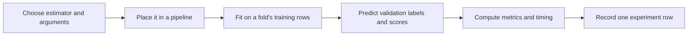

# Part 3 — Writing model code and reading the results

[Previous: Preprocessing](Week1_Part2_Preprocessing_and_Pipelines.md) · [Next: Selection and tuning](Week1_Part4_Feature_Selection_and_Tuning.md)

## 1. One interface, five models

The five required models are Logistic Regression, Decision Tree, Random Forest, KNN, and SVM. A neural network is not part of this assignment. You can understand neural networks and still struggle with library code; those are different skills.

Learn this shared pattern first:

```text
import the class → construct an object → fit on training data
→ predict on held-out data → compare predictions with known answers
```



Part 4 uses cross-validation for comparison. The final `X_test` remains aside during all choices. A validation fold is for choosing; the final test is for reporting the chosen model's performance once.

## 2. Constructor cards

Imports for these cards:

```python
from sklearn.linear_model import LogisticRegression
from sklearn.tree import DecisionTreeClassifier
from sklearn.ensemble import RandomForestClassifier
from sklearn.neighbors import KNeighborsClassifier
from sklearn.svm import SVC
```

The lines below create **unfitted** objects. They do not train until you call `fit`. Construction parameters are choices you make; learned coefficients and trees appear after fitting.

### `LogisticRegression`

- **Purpose:** Fit a linear classification boundary with probabilistic output.
- **Syntax:** `LogisticRegression(C=1.0, solver="lbfgs", max_iter=1000, class_weight="balanced", random_state=42)`
- **Arguments:** Smaller `C` means stronger regularization; `solver` chooses the optimizer; `max_iter` limits optimization work; `class_weight` adjusts training loss weights.
- **Returns:** An unfitted classifier.
- **Toy example:** `LogisticRegression(C=0.1, max_iter=1000)` chooses stronger regularization than `C=1.0`.
- **Assignment use:** Put it after imputation, selection, and scaling.
- **Common error:** Ignoring `ConvergenceWarning`. Check scaling and solver compatibility before only increasing iterations.
- **Learner task:** Construct it, inspect its parameters, and explain the difference between `C` and `coef_`.

`max_iter` is a convergence budget, not a direct capacity knob like tree depth. The assignment requests that you vary it; document whether the optimizer actually converged.

### `DecisionTreeClassifier`

- **Purpose:** Learn a sequence of feature-based decisions.
- **Syntax:** `DecisionTreeClassifier(max_depth=None, min_samples_leaf=1, class_weight="balanced", random_state=42)`
- **Arguments:** `max_depth` limits tree depth; `min_samples_leaf` prevents tiny leaves.
- **Returns:** An unfitted classifier.
- **Toy example:** `DecisionTreeClassifier(max_depth=2, random_state=42)` permits a shallow tree.
- **Assignment use:** Compare this model using the same selected feature count and folds as the others. Scaling is unnecessary.
- **Common error:** Treating very high training accuracy as proof of generalization.
- **Learner task:** Predict how increasing minimum leaf size affects training flexibility.

### `RandomForestClassifier`

- **Purpose:** Combine many trees trained with randomness to reduce reliance on one tree.
- **Syntax:** `RandomForestClassifier(n_estimators=100, max_depth=None, min_samples_split=2, min_samples_leaf=1, class_weight="balanced", random_state=42, n_jobs=1)`
- **Arguments:** Tree count, depth limit, minimum samples to split, minimum leaf size, and parallel workers.
- **Returns:** An unfitted classifier.
- **Toy example:** `RandomForestClassifier(n_estimators=50, max_depth=5, random_state=42)` makes a smaller forest.
- **Assignment use:** It is both one required prediction model and, separately, a possible selector in Part 4. These are different fitted objects.
- **Common error:** Setting both the outer search and inner forest to use every CPU, causing excessive parallel work.
- **Learner task:** Keep `n_jobs=1` inside the forest while learning; parallelize the outer search later if needed.

### `KNeighborsClassifier`

- **Purpose:** Predict from nearby training examples.
- **Syntax:** `KNeighborsClassifier(n_neighbors=5, weights="uniform", metric="minkowski", p=2)`
- **Arguments:** Neighbor count; uniform or distance-based votes; distance definition. Minkowski with `p=2` is Euclidean distance.
- **Returns:** An unfitted classifier.
- **Toy example:** `KNeighborsClassifier(n_neighbors=3, weights="distance")` gives closer neighbors stronger votes.
- **Assignment use:** Scale features so a large-unit sensor does not dominate distance.
- **Common error:** Choosing more neighbors than there are training rows in a fold. KNN has no `class_weight` constructor argument.
- **Learner task:** Explain why its fit can be quick while prediction is relatively expensive.

### `SVC`

- **Purpose:** Fit a support-vector classifier with a chosen kernel.
- **Syntax:** `SVC(C=1.0, kernel="rbf", gamma="scale", class_weight="balanced", probability=False)`
- **Arguments:** `C` controls regularization; `kernel` changes the boundary family; `gamma` controls RBF locality; `probability` enables an extra probability-estimation procedure.
- **Returns:** An unfitted classifier.
- **Toy example:** `SVC(kernel="linear", C=0.1)` fits a regularized linear boundary.
- **Assignment use:** Scale inputs; use `decision_function` for ROC-AUC. You do not need `probability=True` just to calculate AUC.
- **Common error:** Calling `predict_proba` when probability estimation is disabled. Increasing `C` and increasing `gamma` have different meanings.
- **Learner task:** Identify which output contains class labels and which contains decision scores.

## 3. The common methods

### `fit`

- **Purpose:** Learn model state from training examples.
- **Syntax:** `pipeline.fit(X_train, y_train)`
- **Arguments:** X is two-dimensional; y is one-dimensional with matching rows.
- **Returns:** The fitted pipeline itself.
- **Toy example:** Fit a classifier on four rows with labels `[0, 0, 1, 1]`.
- **Assignment use:** The pipeline also fits preprocessing and selection before fitting the model.
- **Common error:** Supplying raw data directly to a model that needs imputed or scaled values.
- **Learner task:** Explain why `trained = pipeline.fit(...)` is not an array of predictions.

### `predict`

- **Purpose:** Return the model's chosen class for each row.
- **Syntax:** `pipeline.predict(X_valid)`
- **Arguments:** Raw candidate inputs matching the pipeline's fitted schema.
- **Returns:** An array of shape `(n_valid,)`, here containing 0 and 1.
- **Toy example:** For three new records, the result might be `array([0, 1, 0])`.
- **Assignment use:** Compute accuracy, precision, recall, F1, and confusion matrix.
- **Common error:** Passing y as another argument, or expecting a probability from each 0/1 prediction.
- **Learner task:** Compare the lengths of predictions and the validation target.

### `predict_proba`

- **Purpose:** Return estimated class probabilities.
- **Syntax:** `pipeline.predict_proba(X_valid)`
- **Arguments:** The same inputs used by `predict`.
- **Returns:** An array shaped `(n_valid, n_classes)`; columns follow `pipeline.classes_`.
- **Toy example:** With classes `[0, 1]`, a row `[0.8, 0.2]` gives probability 0.2 for class 1.
- **Assignment use:** Extract the class-1 column for ROC-AUC when the model supports probabilities.
- **Common error:** Assuming column 1 always means your positive class without checking class order.
- **Learner task:** Find the class-1 position using `list(pipeline.classes_).index(1)`.

### `decision_function`

- **Purpose:** Return decision scores instead of probabilities.
- **Syntax:** `pipeline.decision_function(X_valid)`
- **Arguments:** Matching validation inputs.
- **Returns:** For a binary SVC, one score per row; positive values favor `classes_[1]`.
- **Toy example:** Scores `[-1.2, 0.3, 2.1]` rank the third example highest for the positive class when classes are `[0, 1]`.
- **Assignment use:** Supply SVC scores to ROC-AUC while leaving `probability=False`.
- **Common error:** Interpreting a score of 2.1 as probability 210%.
- **Learner task:** Explain why AUC can use a ranking score without calibrated probabilities.

### `get_params`

- **Purpose:** Inspect configurable parameters without guessing their names.
- **Syntax:** `estimator.get_params(deep=True)`
- **Arguments:** `deep=True` includes nested estimator parameters.
- **Returns:** A dictionary.
- **Toy example:** `LogisticRegression().get_params()["C"]` gives the constructor setting.
- **Assignment use:** Find valid names such as `model__C` in a pipeline before writing a search grid.
- **Common error:** Confusing `get_params()` settings with learned weights like `coef_`.
- **Learner task:** Find the model's iteration limit through the pipeline dictionary.

## 4. Metrics: choose the right input before the function

Walking is the positive class, `1`. In your current labelled subset it is rare. Predicting zero for every row would produce roughly 96% accuracy and catch no walking windows. That is why accuracy alone is a weak success criterion here.

Class weights make minority-class mistakes more costly during fitting; they do not manufacture more walking observations or guarantee good recall. Use `class_weight="balanced"` for the four supporting estimators, and compare KNN without it. This is a documented baseline choice, not identical internal behavior across algorithms.

Imports:

```python
from sklearn.metrics import (
    accuracy_score, precision_score, recall_score, f1_score,
    roc_auc_score, confusion_matrix,
)
```

### `accuracy_score`

- **Purpose:** Measure the fraction of correct class decisions.
- **Syntax:** `accuracy_score(y_true, y_pred)`
- **Arguments:** Known labels first; predicted labels second.
- **Returns:** A float between 0 and 1.
- **Toy example:** `accuracy_score([0, 0, 1, 1], [0, 0, 0, 1])` is 0.75.
- **Assignment use:** Required comparison column, not the sole selection rule.
- **Common error:** Reporting it alone on imbalanced data.
- **Learner task:** Calculate the all-zero baseline accuracy by hand.

### `precision_score`

- **Purpose:** Ask: of predicted walking rows, how many were really walking?
- **Syntax:** `precision_score(y_true, y_pred, pos_label=1, zero_division=0)`
- **Arguments:** `pos_label` defines the positive class; `zero_division=0` returns zero if no positive predictions exist.
- **Returns:** A float.
- **Toy example:** `precision_score([0, 1, 1], [1, 1, 0], zero_division=0)` is 0.5.
- **Assignment use:** Quantify false alarms among walking predictions.
- **Common error:** Passing probability scores instead of class predictions.
- **Learner task:** Identify false positives in the toy example.

### `recall_score`

- **Purpose:** Ask: of actual walking rows, how many did we catch?
- **Syntax:** `recall_score(y_true, y_pred, pos_label=1, zero_division=0)`
- **Arguments:** Known and predicted labels; positive class 1.
- **Returns:** A float.
- **Toy example:** `recall_score([0, 1, 1], [0, 1, 0], zero_division=0)` is 0.5.
- **Assignment use:** Quantify missed walking windows.
- **Common error:** Swapping precision and recall because both describe positive cases.
- **Learner task:** Change one false negative to a true positive and predict the new recall.

### `f1_score`

- **Purpose:** Combine positive-class precision and recall using their harmonic mean.
- **Syntax:** `f1_score(y_true, y_pred, pos_label=1, zero_division=0)`
- **Arguments:** Class labels, not scores; the default binary interpretation fits this target.
- **Returns:** A float.
- **Toy example:** Precision 1 and recall 0.5 produce F1 about 0.667.
- **Assignment use:** Provisional primary selection metric, measured on validation folds.
- **Common error:** Choosing weighted-average F1 and thinking it is the walking-class F1.
- **Learner task:** Report which class and averaging convention your metric uses.

### `roc_auc_score`

- **Purpose:** Measure how well scores rank positives above negatives across thresholds.
- **Syntax:** `roc_auc_score(y_true, positive_scores)`
- **Arguments:** Known binary labels and continuous class-1 probabilities or decision scores.
- **Returns:** A float; both classes must be present for an interpretable binary AUC.
- **Toy example:** `roc_auc_score([0, 0, 1, 1], [0.1, 0.2, 0.7, 0.9])` is 1.0.
- **Assignment use:** A required supporting metric; it answers a different question from F1 at the default threshold.
- **Common error:** Passing hard labels, the probability of class 0, or silently reporting a one-class fold result. Depending on version, undefined cases may warn/return NaN or fail.
- **Learner task:** Check class presence and the score vector's shape before calling it.

### `confusion_matrix`

- **Purpose:** Count the four kinds of binary decision outcomes.
- **Syntax:** `confusion_matrix(y_true, y_pred, labels=[0, 1])`
- **Arguments:** Explicit label order keeps interpretation stable.
- **Returns:** A 2×2 array: rows are actual labels, columns predicted labels, arranged `[[TN, FP], [FN, TP]]`.
- **Toy example:** `confusion_matrix([0, 0, 1, 1], [0, 1, 0, 1], labels=[0, 1])` contains one in every cell.
- **Assignment use:** Explain why a model's F1 or recall is low.
- **Common error:** Reading rows as predictions and swapping false positives with false negatives.
- **Learner task:** Reconstruct precision and recall from these four counts.

### `time.perf_counter`

Import: `from time import perf_counter`.

- **Purpose:** Measure elapsed time for an operation.
- **Syntax:** `start = perf_counter()`; run fitting; `seconds = perf_counter() - start`.
- **Arguments:** None.
- **Returns:** A float clock reading; the difference is elapsed seconds.
- **Toy example:** Put two readings around a small loop; the difference measures the loop's elapsed time.
- **Assignment use:** Time pipeline fitting, including preprocessing and selection, and state that definition.
- **Common error:** Including printing, plotting, or the whole search and calling it one model's training time.
- **Learner task:** Keep prediction time separate; KNN can otherwise appear misleadingly cheap.

## 5. Complete toy example: labels and scores are different

This block evaluates a single frozen toy model. It demonstrates calls; it is not the 15-experiment comparison routine or an ExtraSensory solution.

```python
# TOY: binary evaluation
from time import perf_counter
from sklearn.datasets import make_classification
from sklearn.model_selection import train_test_split
from sklearn.pipeline import Pipeline
from sklearn.preprocessing import StandardScaler
from sklearn.linear_model import LogisticRegression
from sklearn.metrics import accuracy_score, precision_score, recall_score
from sklearn.metrics import f1_score, roc_auc_score, confusion_matrix

X, y = make_classification(n_samples=100, n_features=4, n_informative=2,
                           n_redundant=0, random_state=42)
X_train, X_valid, y_train, y_valid = train_test_split(
    X, y, test_size=0.2, stratify=y, random_state=42
)
pipe = Pipeline([
    ("scaler", StandardScaler()),
    ("model", LogisticRegression(max_iter=1000, class_weight="balanced")),
])
start = perf_counter()
pipe.fit(X_train, y_train)
training_time = perf_counter() - start
pred = pipe.predict(X_valid)
positive_column = list(pipe.classes_).index(1)
scores = pipe.predict_proba(X_valid)[:, positive_column]
print("prediction and score shapes:", pred.shape, scores.shape)
print({
    "accuracy": accuracy_score(y_valid, pred),
    "precision": precision_score(y_valid, pred, zero_division=0),
    "recall": recall_score(y_valid, pred, zero_division=0),
    "f1_score": f1_score(y_valid, pred, zero_division=0),
    "roc_auc": roc_auc_score(y_valid, scores),
    "training_time": training_time,
})
print(confusion_matrix(y_valid, pred, labels=[0, 1]))
```

Expected structure: two `(20,)` arrays, a metric dictionary, and a 2×2 matrix. Do not memorize the numeric score: understand which operation produced each object.

**Predict first:** Could AUC be high while recall at the default threshold is low?

<details><summary>Read after predicting</summary>

Yes. Ranking positives above negatives can be good even when few scores cross the decision threshold. F1 and recall use chosen class decisions; AUC uses score ordering. Threshold selection, if added later, must use validation data rather than the final test.

</details>

## 6. First cells, then a reusable function

Initially write one cell each for constructing a pipeline, fitting, predicting labels, extracting scores, computing metrics, and recording a row. Debugging six clear steps is easier than debugging an unfamiliar function that hides all six.

When those steps work, refactor them yourself:

```python
# Assignment TODO — a function contract, not a finished implementation.
def evaluate_model(name, selection_method, pipeline,
                   X_train, X_test, y_train, y_test) -> dict:
    """Fit and evaluate one explicitly chosen split.

    During development, X_test/y_test here must be an INNER validation split.
    The final held-out test is reserved for the frozen winning configuration.
    """
    # TODO: validate matching row counts and both classes in evaluation labels.
    # TODO: time pipeline fitting.
    # TODO: get predictions and positive scores; branch for SVC if needed.
    # TODO: return required metrics, selected count, method, and timing.
    raise NotImplementedError("Implement one step at a time")
```

The names `X_test` and `y_test` in this requested signature describe the evaluation arguments; they do not grant permission to compare all models on your final test set. Part 4 uses cross-validation directly for those comparisons.

Helper logic in plain English:

```text
Fit the pipeline on this split's training rows.
Predict classes on its evaluation rows.
If probability output is supported, choose the class-1 column.
Otherwise, for the binary SVC, use its decision scores.
Compute metrics against evaluation labels.
Return a dictionary, so the caller can append it to a list.
```

For ordinary lists, `rows.append(result)` adds one dictionary and returns `None`. Then `pd.DataFrame(rows)` builds one row per dictionary. Do not write `rows = rows.append(result)`.

## 7. The comparison table contract

Use consistent field names:

| Assignment requirement | Column in the guide |
|---|---|
| Model | `model` |
| Selection method | `feature_selection_method` |
| Number of features | `number_of_features` |
| Accuracy / precision / recall | `accuracy`, `precision`, `recall` |
| F1-score / ROC-AUC | `f1_score`, `roc_auc` |
| Training time | `training_time` in seconds |

Add `evaluation` (`cv_mean` or `final_test`) and `stage` (`baseline` or `tuned`) so a reader cannot mistake validation estimates for final-test results. Record fold variability alongside means if possible. All 15 baseline rows should use the same folds, metrics, and fit-time definition.

The assignment mentions choosing by accuracy in one section and recommends F1 as primary in another. Until clarified, rank by validation F1, show accuracy too, and name both leaders if they differ. Do not quietly rewrite the requirement or pick whichever metric makes your model look best.

## 8. Debugging and your next task

- **`NotFittedError`:** Check that the exact pipeline you are predicting with was fitted.
- **`ValueError: Input X contains NaN`:** Verify the imputer is inside that pipeline, not only in an unrelated toy cell.
- **Unexpected feature count:** Compare raw pipeline inputs with the final model's selected inputs; these counts should differ.
- **All-zero predictions:** Inspect class imbalance, confusion matrix, pipeline steps, and scores. Changing the metric does not change predictions.
- **Unexpected keyword argument:** Use the specific estimator's constructor documentation; KNN does not support every Logistic Regression option.

**Next assignment task:** Construct all five estimators and describe which ones need scaling. Leave feature selection as a named TODO until Part 4, rather than presenting a full-feature result as the required 20-feature result.

**Teach-back:** Why do F1 and ROC-AUC receive different inputs?

**Exam question:** A classifier has 96% accuracy and zero walking recall. Is it useful for detecting walking? Justify with class balance.

**Independent variation:** In the toy example replace Logistic Regression with SVC, and replace probability extraction with decision scores.

References: [LogisticRegression](https://scikit-learn.org/stable/modules/generated/sklearn.linear_model.LogisticRegression.html), [SVC](https://scikit-learn.org/stable/modules/generated/sklearn.svm.SVC.html), [classification metrics](https://scikit-learn.org/stable/modules/model_evaluation.html), [RandomForestClassifier](https://scikit-learn.org/stable/modules/generated/sklearn.ensemble.RandomForestClassifier.html).

[Next: Part 4 — Feature selection and tuning](Week1_Part4_Feature_Selection_and_Tuning.md)
