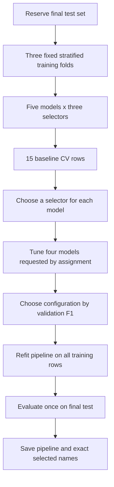

# Part 4 — Choose 20 features, compare fairly, then tune

[Previous: Models and evaluation](Week1_Part3_Models_and_Evaluation.md) · [Next: Artifacts](Week1_Part5_Artifacts_and_Reproducibility.md)

## 1. What problem are we solving?

The assignment asks for five models, a comparison of feature-selection methods, exactly 20 selected features, and tuning. These are related decisions, but they are not the same decision.

- **Selection method:** how we choose the 20 input columns.
- **Model:** how we use those columns to predict walking.
- **Hyperparameters:** settings chosen before fitting, such as tree depth or SVM `C`.
- **Learned parameters:** fitted weights, split thresholds, or stored training examples.

The classifier at the end of the pipeline must receive exactly 20 features. The complete saved pipeline can still accept all candidate columns because it performs selection internally. Part 5 explains this input contract.



A once-computed top-20 list from the entire training set still leaks into inner validation folds if reused during CV. Each fold's selector must learn from that fold's training portion. A pipeline makes this automatic when passed as the estimator to CV or search. See the [official leakage example](https://scikit-learn.org/stable/common_pitfalls.html).

## 2. Shared step order and assumptions

Use these names and this order:

```text
imputer → selector → scaler → model
```

Use `SimpleImputer(strategy="most_frequent", keep_empty_features=True)` as the shared beginner baseline described in Part 2. This preserves categorical values and feature positions. Use `StandardScaler()` for LR/KNN/SVM and `"passthrough"` for trees.

All candidate inputs must be numeric. Missing targets are already removed. Validate at least 20 candidate columns before fitting. Keeping an empty column preserves the schema, not its usefulness: report constants, all-empty features, and zero selector scores if they appear. Do not claim that 20 selected columns means 20 informative columns.

## 3. Method A: absolute correlation

Pearson correlation measures a linear relationship. With binary y it measures the association of each numeric input with class membership. A correlation of -0.8 is stronger in magnitude than +0.2, so rank absolute values while retaining signed values for interpretation.

### `DataFrame.corrwith`

Import: `import pandas as pd`.

- **Purpose:** Calculate one correlation for each column against an aligned Series.
- **Syntax:** `X_train.corrwith(y_train)`
- **Arguments:** y must align with X's row index; the default method is Pearson.
- **Returns:** A Series indexed by feature name, containing signed correlations.
- **Toy example:** `pd.DataFrame({"x": [1, 2, 3]}).corrwith(pd.Series([0, 0, 1]))` returns one value.
- **Assignment use:** Q3.1's training-only top-five explanatory table and focused heatmap.
- **Common error:** Misaligned pandas indices silently change which rows are paired; constants produce undefined correlations.
- **Learner task:** Check index equality, exclude the target and other labels, and keep signed values alongside the ranking.

### `Series.abs`, `sort_values`, and `head`

- **Purpose:** Rank association strength without discarding strong negative relationships.
- **Syntax:** `signed_correlations.abs().sort_values(ascending=False).head(5)`
- **Arguments:** Descending order; `head(5)` keeps the first five values.
- **Returns:** A Series, still indexed by feature names.
- **Toy example:** `pd.Series({"a": -0.8, "b": 0.2}).abs().sort_values(ascending=False)` puts `a` first.
- **Assignment use:** Show the five strongest candidates, not a precomputed selector reused across CV folds.
- **Common error:** Selecting the target's self-correlation or treating NaN as strong evidence.
- **Learner task:** Explain why an input with signed correlation -0.8 can help prediction.

For Q3.1, use those five names plus the target in a labelled correlation heatmap; the EDA guide has plotting syntax. Clearly state whether that descriptive table used raw pairwise-complete values or training-imputed values. The actual CV selector below scores imputed values, so its order need not exactly match a raw EDA table.

### `r_regression`

Import: `from sklearn.feature_selection import r_regression`.

- **Purpose:** Calculate one Pearson correlation coefficient per numeric input column.
- **Syntax:** `r_regression(X, y, force_finite=True)`
- **Arguments:** Numeric finite X and numeric y; `force_finite=True` maps undefined constant-column results to zero.
- **Returns:** A one-dimensional NumPy score array in input-column order.
- **Toy example:** A perfectly decreasing input against an increasing target has a coefficient near -1.
- **Assignment use:** Wrap the absolute values in a score function for `SelectKBest`, so correlation ranking is fitted inside CV.
- **Common error:** Passing the signed coefficients directly to a largest-score selector, which misses strong negative relationships.
- **Learner task:** Trace `X → signed scores → absolute scores → 20-column mask`.

Generic helper, not an ExtraSensory solution:

```python
# HELPER: reusable absolute Pearson scoring
import numpy as np
from sklearn.feature_selection import r_regression

def absolute_pearson_scores(X, y):
    return np.abs(r_regression(X, y, force_finite=True))
```

When persisting a pipeline containing this helper, place its definition in an importable `week1_helpers.py` module and import it into the notebook. A notebook-only function or lambda is not a reliable dependency in a fresh process. Part 5 describes what to submit.

## 4. Method B: mutual information

Mutual information can detect dependence that a straight-line correlation misses. Its score is not signed and is not a probability. Larger scores suggest more dependence under this estimator, not causation.

### `mutual_info_classif`

Import: `from sklearn.feature_selection import mutual_info_classif`.

- **Purpose:** Score each input's dependence on a categorical target.
- **Syntax:** `mutual_info_classif(X, y, discrete_features=mask, random_state=42)`
- **Arguments:** `mask` is one boolean per input feature; `True` means discrete. `random_state` controls the small randomness used for continuous values.
- **Returns:** A nonnegative score array, one value per feature.
- **Toy example:** For columns `[temperature, switch_state]`, use a mask `[False, True]`.
- **Assignment use:** Treat documented `discrete:` indicators as discrete; inspect other feature meanings instead of assuming every float is continuous.
- **Common error:** For dense X the automatic default treats inputs as continuous. That is unsuitable for known binary indicators.
- **Learner task:** Build a schema-based mask in the exact order of X's columns, and verify its length.

The imputer preserves column width in this guide, and selection happens before scaling, so that mask still describes the values received by the score function. If you later reorder or remove columns, rebuild the mask. If you use a different preprocessing design, do not carry the old mask forward blindly. See [mutual_info_classif's discrete-feature rules](https://scikit-learn.org/stable/modules/generated/sklearn.feature_selection.mutual_info_classif.html).

### `functools.partial`

Import: `from functools import partial`.

- **Purpose:** Make a callable with some arguments already fixed.
- **Syntax:** `mi_scores = partial(mutual_info_classif, discrete_features=mask, random_state=42)`
- **Arguments:** The original function, followed by fixed keyword arguments.
- **Returns:** A callable that still accepts X and y.
- **Toy example:** `partial(round, ndigits=2)(1.234)` gives 1.23.
- **Assignment use:** Pass reproducible MI scoring to `SelectKBest`, which will supply each fold's X and y.
- **Common error:** Passing the result of an already-executed scoring function instead of a function to call later.
- **Learner task:** Explain why `score_func=mi_scores` has no parentheses.

### `SelectKBest`

Import: `from sklearn.feature_selection import SelectKBest`.

- **Purpose:** Keep k columns with the highest scores produced during fitting.
- **Syntax:** `SelectKBest(score_func=mi_scores, k=20)` or `SelectKBest(score_func=absolute_pearson_scores, k=20)`.
- **Arguments:** A scoring callable and the selected count.
- **Returns:** An unfitted selector; after fitting, `scores_` and a support mask are available.
- **Toy example:** With 25 input columns, `k=20` reduces transformed width to 20 when there are enough inputs.
- **Assignment use:** Implement both correlation and MI selection within the same pipeline interface.
- **Common error:** Expecting it to invent features when fewer than 20 exist. Tie selection can be arbitrary; all-zero scores do not establish useful signal.
- **Learner task:** Check candidate count before fitting and transformed width afterward.

## 5. Method C: model-based importance

Here a separate Random Forest ranks candidate inputs. Another estimator, such as KNN, may then make the final predictions from its chosen 20 columns. The selector's forest and the prediction model have different jobs.

### `SelectFromModel`

Import: `from sklearn.feature_selection import SelectFromModel`.

- **Purpose:** Select inputs using an estimator's importance or coefficient values.
- **Syntax:** `SelectFromModel(forest, threshold=-np.inf, max_features=20)`
- **Arguments:** A fresh importance-producing estimator; `threshold=-np.inf` disables threshold rejection; `max_features=20` caps selection at 20.
- **Returns:** An unfitted selector; its fitted forest is in `estimator_`.
- **Toy example:** Fit it on 25 columns, then count `selector.get_support()` to see the chosen 20.
- **Assignment use:** Compare a nonlinear multifeature selector with correlation and MI. Use `class_weight="balanced"` and `random_state=42` in the forest.
- **Common error:** Setting only `max_features=20` while leaving the default importance threshold; the threshold may select fewer than 20.
- **Learner task:** Verify both the count and the selected names after fitting.

Exactly 20 is guaranteed only when at least 20 candidate columns are available under this configuration. Impurity importance has biases, including toward some high-cardinality inputs; report the scoring source rather than presenting it as proof of causation. The parameter interaction is documented in [SelectFromModel](https://scikit-learn.org/stable/modules/generated/sklearn.feature_selection.SelectFromModel.html).

## 6. Recover names without losing column order

### `get_support`

- **Purpose:** Identify which input positions the fitted selector retained.
- **Syntax:** `selector.get_support()` or `selector.get_support(indices=True)`.
- **Arguments:** `indices=True` requests integer positions instead of booleans.
- **Returns:** A mask or integer array in the selector input order.
- **Toy example:** A mask `[True, False, True]` selects the first and third names.
- **Assignment use:** Recover exactly 20 names for `selected_features.json`.
- **Common error:** Applying a mask to a column list from before an imputer or transformer changed the schema.
- **Learner task:** Compare the mask length with the names entering the selector, then count its true entries.

### `get_feature_names_out`

- **Purpose:** Ask a fitted transformer for the names of its output features.
- **Syntax:** `imputer.get_feature_names_out()`; `selector.get_feature_names_out(imputed_names)`.
- **Arguments:** The optional input names must match the fitted input width and schema.
- **Returns:** A NumPy array of names.
- **Toy example:** A width-preserving imputer fitted to a DataFrame with `a,b,c` keeps those names; the selector returns a subset.
- **Assignment use:** Use the fitted imputer names, then the fitted selector names. Store the resulting order, not alphabetically sorted names.
- **Common error:** Confusing original-column order with score-rank order. The transformer normally preserves input order among selected columns.
- **Learner task:** Verify `len(selected_names) == 20` and that the final model's fitted input width is 20.

## 7. Complete toy example: three different ways to retain 20 columns

This demonstrates the selector interfaces on synthetic data. Run it separately from the assignment; its training scores are not an evaluation result. The final feature is a binary switch, and the first feature is deliberately entirely missing.

```python
# TOY: three selectors
import numpy as np
import pandas as pd
from functools import partial
from sklearn.datasets import make_classification
from sklearn.impute import SimpleImputer
from sklearn.feature_selection import SelectKBest, SelectFromModel
from sklearn.feature_selection import mutual_info_classif, r_regression
from sklearn.ensemble import RandomForestClassifier
from sklearn.pipeline import Pipeline

def absolute_pearson_scores(X, y):
    return np.abs(r_regression(X, y, force_finite=True))

values, target = make_classification(n_samples=120, n_features=25,
    n_informative=5, n_redundant=0, random_state=42)
toy = pd.DataFrame(values, columns=[f"measurement_{i}" for i in range(25)])
toy.iloc[:, 0] = np.nan
toy.iloc[:, -1] = (toy.iloc[:, -1] > 0).astype(int)
discrete_mask = np.array([False] * 24 + [True])
mi_scores = partial(mutual_info_classif,
                    discrete_features=discrete_mask, random_state=42)
selectors = {
    "correlation": SelectKBest(absolute_pearson_scores, k=20),
    "mutual_information": SelectKBest(mi_scores, k=20),
    "forest_importance": SelectFromModel(
        RandomForestClassifier(n_estimators=30, class_weight="balanced",
                               random_state=42, n_jobs=1),
        threshold=-np.inf, max_features=20),
}
for name, selector in selectors.items():
    prep = Pipeline([
        ("imputer", SimpleImputer(strategy="most_frequent", keep_empty_features=True)),
        ("selector", selector),
    ])
    reduced = prep.fit_transform(toy, target)
    names_in = prep.named_steps["imputer"].get_feature_names_out()
    names_out = prep.named_steps["selector"].get_feature_names_out(names_in)
    assert reduced.shape == (120, 20)
    assert len(names_out) == 20
    print(name, reduced.shape, names_out[:3])
```

This is a width check, not evidence that the selected features predict new data well. Several MI scores may tie at zero. Inspect that rather than describing every selected column as important.

**Predict first:** If the selector was fitted once before cross-validation, what information could leak?

<details><summary>Read after predicting</summary>

The future validation-fold labels helped choose its features. Although the final test may still be untouched, the CV comparison is optimistic. Passing the complete pipeline into CV refits the selector on each fold's training rows.

</details>

## 8. Compare 15 combinations on training data

Imports for the following cards:

```python
from sklearn.base import clone
from sklearn.model_selection import StratifiedKFold, cross_validate, GridSearchCV
from sklearn.metrics import make_scorer, precision_score, recall_score, f1_score
```

### `clone`

- **Purpose:** Create an unfitted estimator with the same constructor settings.
- **Syntax:** `clone(pipeline)`
- **Arguments:** A compatible scikit-learn estimator or pipeline.
- **Returns:** A fresh, unfitted object.
- **Toy example:** Cloning a fitted scaler preserves its options but not its learned mean.
- **Assignment use:** Give each experiment a fresh model and selector instead of accidentally sharing fitted objects.
- **Common error:** Expecting a clone to predict before fitting, or using it as a backup of learned state.
- **Learner task:** Explain the difference between cloning an estimator and saving a fitted estimator.

### `StratifiedKFold`

- **Purpose:** Make folds with roughly similar class proportions.
- **Syntax:** `StratifiedKFold(n_splits=3, shuffle=True, random_state=42)`
- **Arguments:** Three folds; shuffled repeatably.
- **Returns:** A splitter object used by CV/search.
- **Toy example:** Three folds with 90 balanced rows use about 60 training and 30 validation rows per fit.
- **Assignment use:** Reuse the same splitter settings for all 15 combinations and the later searches.
- **Common error:** Too few minority examples for the folds, or thinking stratification separates participants/time windows.
- **Learner task:** Check minority counts and explain why grouped evaluation later needs a different splitter.

### `make_scorer`

- **Purpose:** Adapt a metric function into a callable that CV can use with an estimator.
- **Syntax:** `make_scorer(f1_score, pos_label=1, zero_division=0)`
- **Arguments:** The metric function plus its fixed options.
- **Returns:** A scorer object.
- **Toy example:** Fixing `zero_division=0` gives consistent behavior for a model that predicts no positives.
- **Assignment use:** Define walking-class precision, recall, and F1 consistently across experiments.
- **Common error:** Passing a number already computed by `f1_score(...)` as a scorer.
- **Learner task:** Build scorers once and use the same dictionary for baseline CV and search.

```python
# REFERENCE: scoring configuration, assumes imports above.
scoring = {
    "accuracy": "accuracy",
    "precision": make_scorer(precision_score, zero_division=0),
    "recall": make_scorer(recall_score, zero_division=0),
    "f1": make_scorer(f1_score, zero_division=0),
    "roc_auc": "roc_auc",
}
```

The built-in ROC-AUC scorer can request decision scores from binary SVC, so you can leave `probability=False`.

### `cross_validate`

- **Purpose:** Fit and score fresh estimator copies across folds with multiple metrics.
- **Syntax:** `cross_validate(pipeline, X_train, y_train, cv=cv, scoring=scoring, return_estimator=True, error_score="raise", n_jobs=1)`
- **Arguments:** The **complete unfitted pipeline**, training data only, fixed folds/scorers; `error_score="raise"` exposes failures while learning.
- **Returns:** A dictionary of arrays such as `test_f1`, `test_roc_auc`, `fit_time`, plus fitted fold estimators when requested.
- **Toy example:** Three folds produce three values in each metric array.
- **Assignment use:** Store means in one comparison row, and inspect fitted selectors to confirm 20 inputs per fold.
- **Common error:** The `test_` prefix here means the held-out fold, not your final `X_test`.
- **Learner task:** Map mean `test_f1` to the table's `f1_score`, mean `fit_time` to seconds, and label the row `evaluation="cv_mean"`.

Start sequentially (`n_jobs=1`) for clearer errors and timing. Outer parallelism can come later; do not also parallelize each nested forest. CV means used repeatedly for selection are development estimates, not an unbiased final score.

### Assignment TODO — build the comparison loop

```python
# Assignment TODO — implement after one model/selector combination makes sense.
# TODO: create dictionaries of the five models and three selectors.
# TODO: make the same three-fold splitter and scoring dictionary for all runs.
# TODO: for each model and selector, construct fresh pipeline components.
# TODO: use passthrough scaling for trees, StandardScaler for LR/KNN/SVM.
# TODO: cross_validate on X_train/y_train only.
# TODO: verify 20 selected names in each fitted fold pipeline.
# TODO: append one metric/timing dictionary per combination.
# TODO: turn the 15 dictionaries into a comparison DataFrame.
```

Inspect the table before tuning: are all counts 20, all metric values finite, all rows labelled as CV results, and all training times measured consistently? A failed experiment is not a zero score; diagnose it and record why it failed.

## 9. Tune the four required models

Choose each model's best selector from baseline CV using F1. Then tune that combination. Decision Tree is required in the comparison, but the assignment's tuning list names only the other four; retain the tree baseline as a candidate.

### `GridSearchCV`

- **Purpose:** Compare parameter combinations using CV and refit the best choice on all supplied training rows.
- **Syntax:** `GridSearchCV(pipeline, param_grid=grid, scoring=scoring, refit="f1", cv=cv, n_jobs=1, error_score="raise")`
- **Arguments:** A complete pipeline; lists of values to try; shared scorers/folds; `refit="f1"` chooses by mean CV F1.
- **Returns:** A search object. After `search.fit(X_train, y_train)`, inspect `best_estimator_`, `best_params_`, `best_score_`, and `cv_results_`.
- **Toy example:** Two `C` values across three folds require six CV fits plus a refit.
- **Assignment use:** Fit searches only on the development training set, never on the final test set.
- **Common error:** Using `C` instead of `model__C` when the estimator is nested inside a pipeline.
- **Learner task:** Predict how many fits a small grid requires before running it.

`model__C` means “the `C` argument of the object in the step named `model`.” `selector__estimator__max_depth` would reach a forest inside a model-based selector, but we keep selector settings fixed for this first assignment comparison.

Small starting grids that vary every requested parameter:

```python
# REFERENCE: grid syntax. These are starting choices, not claimed optimal values.
lr_grid = {
    "model__C": [0.1, 1.0],
    "model__solver": ["lbfgs", "liblinear"],
    "model__max_iter": [500, 1000],
}
rf_grid = {
    "model__n_estimators": [100, 200],
    "model__max_depth": [None, 10],
    "model__min_samples_split": [2, 5],
    "model__min_samples_leaf": [1, 2],
}
svm_grid = [
    {"model__C": [0.1, 1.0, 10.0], "model__kernel": ["linear"]},
    {"model__C": [0.1, 1.0, 10.0], "model__kernel": ["rbf"],
     "model__gamma": ["scale", "auto"]},
]
knn_grid = {
    "model__n_neighbors": [3, 7],
    "model__weights": ["uniform", "distance"],
    "model__metric": ["euclidean", "manhattan"],
}
```

The SVM list contains separate grids so we do not pretend gamma changes the linear kernel. The LR settings use default regularization; if you introduce a penalty parameter, first check solver compatibility in your installed version. Do not suppress convergence warnings to make a search look successful.

### Reading the search outputs

- `best_params_`: dictionary of chosen constructor settings, not learned coefficients.
- `best_score_`: mean CV F1 because `refit="f1"`, not final-test F1.
- `best_estimator_`: a fully fitted pipeline, refitted on all development training rows.
- `cv_results_`: one row per tried parameter combination after conversion with `pd.DataFrame(...)`.

Save every tested configuration's mean metrics in the experiment log, not just the winner. Map `mean_test_f1` to `f1_score` and `mean_fit_time` to `training_time`. Add a JSON-friendly `parameters` field and label these rows `stage="tuned"`, `evaluation="cv_mean"`. Timing here is mean per-fold fit time, not the whole search duration.

## 10. Choose once, evaluate once

Choose the final model/selector/configuration by validation F1; use validation accuracy and then lower fit time as documented tie-breakers. Freeze those choices before opening the final test metrics. If the retained Decision Tree baseline wins, refit its full pipeline on all training rows; a search winner is already refitted by default.

Report the final test metrics in a separate row labelled `final_test`. Do not use them to switch winners, selectors, or thresholds. If you do more development after seeing them, be honest that this is no longer an untouched test set.

Two wording issues in the assignment need visibility:

1. It says accuracy in one selection instruction and recommends F1 elsewhere. Report both and state the provisional F1 rule.
2. It asks for top correlated features while also asking to compare selection methods. Include the correlation baseline and clearly identify the final method. If another method wins, do not call its selected inputs “the top 20 correlations.” Confirm with the instructor whether that phrase is a strict final-selection requirement.

## 11. What-if, debugging, and next task

**Predict first:** If k increases from 20 to 40, must validation F1 improve?

<details><summary>Read after predicting</summary>

No. Additional inputs may add signal, noise, redundancy, or overfitting. Also, 40 violates this assignment's final feature-count constraint regardless of its score. Keep k=20 for submitted comparisons.

</details>

If selection returns fewer than 20 names, inspect the candidate count, imputer output width, and model-based threshold. If a mask length is wrong, trace feature names through each transformer. If CV fails, use `error_score="raise"` and read the first real exception; a table of NaNs is not a completed experiment.

**Your next task:** Implement just one 20-feature selector inside one pipeline and inspect its names. Then implement one CV call. Only after that expand to the 15-row loop and tuning.

**Teach-back:** Why is selecting features on all `X_train` before cross-validation still leakage inside CV?

**Exam question:** Explain the difference between best CV score, refitted best estimator, and final test score.

**Independent variation:** Change the toy mask's last position from discrete to continuous. Predict what assumption changes, then inspect the resulting MI scores when you run it.

References: [r_regression](https://scikit-learn.org/stable/modules/generated/sklearn.feature_selection.r_regression.html), [SelectKBest](https://scikit-learn.org/stable/modules/generated/sklearn.feature_selection.SelectKBest.html), [cross_validate](https://scikit-learn.org/stable/modules/generated/sklearn.model_selection.cross_validate.html), [GridSearchCV](https://scikit-learn.org/stable/modules/generated/sklearn.model_selection.GridSearchCV.html).

[Next: Part 5 — Artifacts and reproducibility](Week1_Part5_Artifacts_and_Reproducibility.md)
