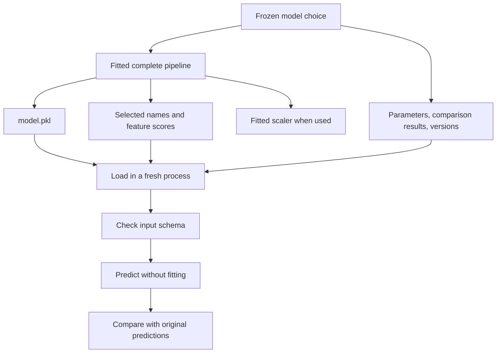

# Part 5 — Save the whole prediction process

[Previous: Selection and tuning](Week1_Part4_Feature_Selection_and_Tuning.md) · [Back to EDA](EDA_Pandas_Engineering_Guide.md)

## 1. What an artifact actually is

An artifact is a saved result of your work: a fitted pipeline, a feature list, a configuration, or a comparison table. Saving only the classifier's weights is not enough if prediction also requires imputation, feature selection, and scaling.

The practical question is: **Could a fresh Python session make the same prediction from the same inputs without retraining anything?**

This guide explains how you will answer that question. The examples are for you to run; no real-time execution or validation of these examples is being claimed.



## 2. Assignment files and what each one means

| File | Contents | Source |
|---|---|---|
| `model.pkl` | Complete fitted imputer → selector → scaler/passthrough → model pipeline | The final refitted training pipeline |
| `selected_features.json` | Target, selected count, method, exact 20 names in transformation order | The fitted selector |
| `hyperparameters.json` | Final model settings, selected method, chosen search settings, selection metric | The frozen configuration |
| `model_comparison.csv` | All model/selector baseline rows and search-configuration results with required metrics | Training-only experiment records; final test explicitly labelled |
| `feature_importance.csv` | `feature`, `score`, `rank`, `source` for the selected inputs | Scores from the fitted selection method |
| `scaler.pkl` | The fitted scaler, if scaling was used | Extracted from the final pipeline |
| `label_encoder.pkl` | Only a fitted encoder that was actually needed | No placeholder encoder |

Additional engineering records: `input_schema.json` for the full raw candidate-input order and `run_metadata.json` for versions, dataset scope, split settings, metric policy, and artifact conventions. These extra files support reproducibility; they are not named requirements in the assignment.

Submit the notebook with the required applicable artifacts. If a custom helper module is needed by the saved pipeline, include it too. A short submission note should explain conditional omissions such as no scaler for a tree or no categorical encoder for numeric inputs.

## 3. Twenty selected features versus the pipeline's raw inputs

There are two different lists:

1. **Raw candidate inputs:** all columns the fitted pipeline expects before its imputer and selector. For the current two-file data, removing 51 label columns plus timestamp and label_source leaves 225 candidates, before any additional documented filtering.
2. **Selected model inputs:** exactly 20 columns emitted by the fitted selector.

Save both lists in their actual order. If `model.pkl` contains the complete pipeline, send it the full candidate DataFrame. Do not preselect 20 columns or apply `scaler.pkl` manually before calling the full pipeline; that repeats or bypasses its steps incorrectly.

`scaler.pkl` is exported separately to satisfy the assignment when scaling is used. The full pipeline remains the main prediction artifact. A standalone scaler alone cannot reproduce the complete preprocessing process.

### `feature_names_in_`

- **Purpose:** Inspect the names an estimator saw during fitting, when fitted with supported named inputs.
- **Syntax:** `final_pipeline.feature_names_in_`
- **Arguments:** None; it is a learned attribute.
- **Returns:** An array of input feature names when that information is available.
- **Toy example:** A pipeline fitted with a DataFrame containing `mass, temperature` records those raw names.
- **Assignment use:** Capture the complete incoming schema separately from the selected 20 names.
- **Common error:** Confusing this with the final classifier's `n_features_in_`, which should be 20 after selection.
- **Learner task:** Explain why these two widths can legitimately differ.

### Input checks before predicting

Use the saved candidate names as the contract. Reject missing required columns or duplicate names with `ValueError`. Reorder a valid table using `incoming.loc[:, expected_names]` only after checking it. Reject unexpected columns unless your application explicitly documents an allowed metadata-stripping step. Never silently substitute missing inputs with zeros.

The contract also includes units and meanings. A column named `temperature` changing from Celsius to Fahrenheit will not be caught by a name check. Record such assumptions when they matter.

## 4. Function cards: paths, JSON, model files, and tables

Imports:

```python
from pathlib import Path
import json
import joblib
import pandas as pd
import numpy as np
```

### `Path.mkdir`

- **Purpose:** Create the artifact directory before writing files.
- **Syntax:** `Path("artifacts").mkdir(parents=True, exist_ok=True)`
- **Arguments:** `parents=True` creates missing parent folders; `exist_ok=True` allows an existing directory.
- **Returns:** `None`; it changes the filesystem.
- **Toy example:** `Path("toy_output").mkdir(exist_ok=True)` creates a local directory if needed.
- **Assignment use:** Create one run's output location; use a separate run directory when preserving earlier experiments.
- **Common error:** Assuming the notebook's working directory is always the file's directory; relative paths use the current working directory.
- **Learner task:** Inspect `Path.cwd()` and print the resolved output path before writing.

### `Path.open` with a context manager

- **Purpose:** Open a text file and close it reliably after use.
- **Syntax:** `with path.open("w", encoding="utf-8") as handle:` followed by indented writing code.
- **Arguments:** `"w"` writes and replaces existing contents; `"r"` reads.
- **Returns:** A file object inside the `with` block.
- **Toy example:** Use the `handle` as the destination for `json.dump({"name": "toy"}, handle)`.
- **Assignment use:** Write JSON as actual structured data.
- **Common error:** Opening a previous run's file in write mode unintentionally; choose the output location deliberately.
- **Learner task:** Explain what the indentation means and why you do not need to call `close()` yourself here.

### `json.dump`

- **Purpose:** Write JSON-compatible Python data to a file.
- **Syntax:** `json.dump(payload, handle, indent=2, allow_nan=False)`
- **Arguments:** A dictionary/list/scalar structure, an open text handle, readable indentation, and strict handling of non-finite numbers.
- **Returns:** `None`; it writes to the file.
- **Toy example:** `json.dump({"count": 2, "features": ["a", "b"]}, handle, indent=2)`.
- **Assignment use:** Save selected names, chosen settings, schema, and metadata.
- **Common error:** NumPy arrays/scalars, estimators, functions, and Infinity are not ordinary portable JSON values. Convert arrays with `.tolist()`, scalar counts with `int`, and scores with `float`; represent unavailable scores as `None`.
- **Learner task:** Prepare a small selected-feature dictionary and explain every key before writing it.

`dump` writes to a file; `dumps` returns a JSON string. Avoid saving the entire `pipeline.get_params()` dictionary directly: it contains objects, and the model-based selector has a `-inf` threshold. Store a small explicit configuration; describe an unbounded threshold with a string if it needs to be recorded.

### `json.load`

- **Purpose:** Read JSON back into Python data.
- **Syntax:** `json.load(handle)` inside a read-mode context manager.
- **Arguments:** An open JSON text file.
- **Returns:** The decoded object, usually a dictionary here.
- **Toy example:** Reading `{"count": 2}` gives a dictionary whose `count` value is integer 2.
- **Assignment use:** Recover expected input names and verify stored selected count and target.
- **Common error:** Loading malformed hand-written JSON with single quotes or trailing commas.
- **Learner task:** Read a JSON file you wrote and access its feature list by key.

### `joblib.dump`

- **Purpose:** Serialize a fitted Python object, including learned model state.
- **Syntax:** `joblib.dump(final_pipeline, output_dir / "model.pkl")`
- **Arguments:** The fitted object and destination path.
- **Returns:** A list of paths written.
- **Toy example:** Save a fitted toy scaler or the full toy pipeline below.
- **Assignment use:** Save the final fitted pipeline and separately its fitted scaler when applicable.
- **Common error:** Saving a newly constructed, unfitted model or the last loop variable instead of the chosen winner.
- **Learner task:** Identify the exact fitted object to save before calling this method.

### `joblib.load`

- **Purpose:** Restore a previously saved object and learned state.
- **Syntax:** `loaded_pipeline = joblib.load(path)`
- **Arguments:** The saved file path.
- **Returns:** The restored object, normally a fitted Pipeline here.
- **Toy example:** After loading, call `loaded_pipeline.predict(toy_rows)` without fitting again.
- **Assignment use:** Demonstrate that a fresh process can reproduce predictions.
- **Common error:** Missing helper modules or incompatible package versions. Load only trusted pickle/joblib files because loading can execute Python code.
- **Learner task:** Explain why fitting immediately after loading would defeat the purpose of this check.

scikit-learn does not promise cross-version compatibility for these saved objects. Record and reproduce the training environment. See [model persistence guidance](https://scikit-learn.org/stable/model_persistence.html).

### `DataFrame.to_csv`

- **Purpose:** Save a rectangular result table as CSV.
- **Syntax:** `results.to_csv(path, index=False)`
- **Arguments:** Destination path; `index=False` omits the usually meaningless row index.
- **Returns:** `None` when writing to a path.
- **Toy example:** `pd.DataFrame([{"model": "toy", "f1_score": 0.5}]).to_csv("toy_results.csv", index=False)`.
- **Assignment use:** Export comparison and selected-feature importance tables.
- **Common error:** Accidentally writing an `Unnamed: 0` index column or replacing numeric metrics with formatted strings too early.
- **Learner task:** Keep full numeric values in the CSV; round only the displayed notebook view.

## 5. Build each artifact from the fitted winner

### Selected features

Use the imputer's fitted output names and the fitted selector's mask or `get_feature_names_out`, as shown in Part 4. Do not recompute correlations or refit selection to generate the file.

Use these keys:

```json
{
  "target": "label:FIX_walking",
  "number_of_features": 20,
  "selection_method": "the_actual_fitted_method",
  "features": []
}
```

This is a **schema illustration**, not a valid completed artifact: replace the empty list with the actual 20 names, in transformation order. Check that the declared count matches the list length and names are unique.

### Hyperparameters

Save the final model class/name, selection method, `primary_metric: "f1"`, fixed random seed, and chosen parameter values. Include `class_weight`, preprocessing strategy, and the fixed selector settings in run metadata so someone can reconstruct the experiment.

`best_params_` contains searched values, not necessarily every meaningful constructor setting. Preserve fixed settings too. Do not copy the assignment's example Random Forest settings and claim they are your optimized results.

### Feature importance

Use the source matching the final selector:

| Selector | Score source | Meaning |
|---|---|---|
| Absolute correlation | `selector.scores_` | Absolute Pearson association on fitted imputed training inputs |
| Mutual information | `selector.scores_` | Estimated dependence score |
| Forest-based selection | `selector.estimator_.feature_importances_` | Selector forest's impurity-based importance |

Align the score array with the imputer's output names, then keep the selected positions. Write `feature`, `score`, `rank`, and `source`. Define rank as descending score among all candidate inputs, with equal scores sharing a rank. Keep an optional all-candidate ranking separately if useful.

The selected-feature JSON preserves transformation order. The importance CSV can be sorted by score for reading. Do not feed its sorted order into the saved pipeline as if it were the original input order.

KNN and a nonlinear SVC do not expose a general `feature_importances_` attribute. The selector's scores are valid ranking information for this file, but label them as selector scores rather than inventing final-model importance.

### Comparison table

Use the required columns from Part 3 and retain evaluation/stage labels. Include the 15 baseline CV rows and the tuning configurations you actually tried. Final test metrics belong in a clearly separate row for the frozen winner; do not compare validation rows and test rows as if they were the same estimate.

### Conditional encoder and scaler

The current target is already numeric 0/1 and the candidate table is numeric. Do not use `LabelEncoder` merely because it appears in a demonstration. Its documented role is target-label encoding; feature categories require an appropriate feature encoder if introduced later. See [LabelEncoder](https://scikit-learn.org/stable/modules/generated/sklearn.preprocessing.LabelEncoder.html).

If encoding was not required, omit `label_encoder.pkl` and document that fact. If the final pipeline skips scaling, omit `scaler.pkl` with the same explanation. If scaling was used, export the **fitted** `final_pipeline.named_steps["scaler"]`, not a new scaler instance.

## 6. Complete toy example: save, reload, compare

This uses a temporary directory that is removed when the block finishes. It demonstrates persistence mechanics and an exact-20 contract on unrelated synthetic data. It does not generate your assignment submission.

```python
# TOY: persistence round trip
from pathlib import Path
from tempfile import TemporaryDirectory
from functools import partial
import json
import joblib
import numpy as np
import pandas as pd
from sklearn.datasets import make_classification
from sklearn.model_selection import train_test_split
from sklearn.impute import SimpleImputer
from sklearn.feature_selection import SelectKBest, mutual_info_classif
from sklearn.preprocessing import StandardScaler
from sklearn.pipeline import Pipeline
from sklearn.linear_model import LogisticRegression

values, labels = make_classification(n_samples=100, n_features=25,
    n_informative=5, n_redundant=0, random_state=42)
toy = pd.DataFrame(values, columns=[f"sensor_{i}" for i in range(25)])
X_train, X_check, y_train, y_check = train_test_split(
    toy, labels, test_size=0.2, stratify=labels, random_state=42
)
pipe = Pipeline([
    ("imputer", SimpleImputer(strategy="most_frequent", keep_empty_features=True)),
    ("selector", SelectKBest(partial(mutual_info_classif,
        discrete_features=False, random_state=42), k=20)),
    ("scaler", StandardScaler()),
    ("model", LogisticRegression(max_iter=1000, class_weight="balanced")),
])
pipe.fit(X_train, y_train)
probe = X_check.iloc[:5]
before = pipe.predict(probe)
scores_before = pipe.predict_proba(probe)
names_in = pipe.named_steps["imputer"].get_feature_names_out()
selected = pipe.named_steps["selector"].get_feature_names_out(names_in).tolist()
assert len(selected) == 20
assert pipe.named_steps["model"].n_features_in_ == 20

with TemporaryDirectory(prefix="toy_model_") as folder:
    out = Path(folder)
    joblib.dump(pipe, out / "model.pkl")
    joblib.dump(pipe.named_steps["scaler"], out / "scaler.pkl")
    payload = {"target": "toy_target", "number_of_features": len(selected),
               "selection_method": "mutual_information", "features": selected}
    with (out / "selected_features.json").open("w", encoding="utf-8") as handle:
        json.dump(payload, handle, indent=2, allow_nan=False)
    with (out / "input_schema.json").open("w", encoding="utf-8") as handle:
        json.dump({"features": X_train.columns.tolist()}, handle, indent=2)

    loaded = joblib.load(out / "model.pkl")
    assert np.array_equal(before, loaded.predict(probe))
    assert np.allclose(scores_before, loaded.predict_proba(probe))
    with (out / "selected_features.json").open(encoding="utf-8") as handle:
        saved_selection = json.load(handle)
    assert saved_selection["features"] == selected
    print("Same predictions; 20 selected features; raw input width:", probe.shape[1])
```

Expected structure: the probe still has 25 raw candidate columns; the final classifier uses 20. Loading must not require any new `fit` call. This in-process toy check is a first step, not a substitute for a fresh-process submission check.

### `numpy.array_equal` and `numpy.allclose`

- **Purpose:** Check equality of class predictions and approximate equality of floating-point scores.
- **Syntax:** `np.array_equal(labels_before, labels_after)`; `np.allclose(scores_before, scores_after)`.
- **Arguments:** Matching arrays; `allclose` allows small numerical tolerance.
- **Returns:** A boolean.
- **Toy example:** Exact `[0, 1]` labels should match; tiny floating-point rounding in scores can still be close.
- **Assignment use:** Detect a broken persistence/input-order path.
- **Common error:** Treating a successful round trip as proof of predictive quality. It checks reproducibility, not accuracy.
- **Learner task:** Deliberately change the probe input and explain why equal predictions are no longer guaranteed.

## 7. Fresh-process use and custom helpers

When you implement the assignment, restart the kernel or open a new Python process with the same environment. Import only what is required to load, construct one correctly ordered probe DataFrame, load `model.pkl`, and predict. Do not rerun training cells first; that can hide missing dependencies.

For the correlation scorer from Part 4, define `absolute_pearson_scores` at module level in `week1_helpers.py`, then import it into the training notebook. Submit that module alongside the notebook/artifacts. The module must be importable when loading. Moving the function after saving does not repair an earlier pickle automatically; fit/save with the intended importable definition.

The MI example uses `functools.partial` of an importable scikit-learn function, so it does not need a notebook-defined scoring callback. The forest selector likewise uses importable built-in classes. Their libraries must still be present in a compatible environment.

For new prediction rows, follow this order:

```text
read schema → verify required columns and meanings → order columns
→ load full pipeline → predict → interpret 1 as walking
```

Do not load the separate scaler and manually transform before the full pipeline. Do not select the final 20 beforehand. Both steps are already included.

## 8. Record the environment you actually used

```python
# REFERENCE: run this in the notebook's selected kernel.
import sys
import platform
import pandas as pd
import sklearn
import joblib

versions = {
    "python": platform.python_version(),
    "pandas": pd.__version__,
    "scikit_learn": sklearn.__version__,
    "joblib": joblib.__version__,
}
print(sys.executable)
print(versions)
```

`sys.executable` tells you which Python is running the notebook. Installing a package into another terminal's Python does not make it available in that kernel. The version attributes above are strings you can include in `run_metadata.json`.

Also record the two source filenames, that they are a practice subset, target spelling, candidate schema, selected count, seed, 80/20 stratified split, three-fold inner CV, F1 policy, and timing definition. Package versions plus these choices are more useful than a bare `model.pkl`.

No local scikit-learn version is asserted by these guides. Check the installed version when you run them. `keep_empty_features` requires a version that supports that parameter; inspect the documentation matching your environment if a constructor rejects it.

### Looking up syntax in your own environment

Import `inspect` and use `inspect.signature(SimpleImputer)` after importing the class. It returns a signature object showing accepted arguments. `help(SimpleImputer)` prints documentation; neither call fits a model. If a call fails, share the version, exact signature/error, and the smallest code example. This is more useful than changing random arguments.

## 9. Assignment TODO — finish artifacts yourself

```python
# Assignment TODO — intentionally incomplete, no training should happen here.
# TODO: identify the final already-fitted pipeline, not the last loop variable.
# TODO: recover raw candidate names and the actual 20 selected names.
# TODO: prepare JSON-friendly selection, parameters, schema, and run metadata.
# TODO: prepare comparison and selector-score DataFrames.
# TODO: create a deliberate output directory and write the required files.
# TODO: export the fitted scaler only if used; document no encoder if unnecessary.
# TODO: restart the process and compare predictions on a fixed probe.
```

Use `ValueError` when selected count, feature order, required columns, or target metadata violates your expected contract. Use `FileNotFoundError` for missing saved files. Keep the original exception details when debugging rather than wrapping everything in an uninformative “something went wrong.”

## 10. What-if and final checkpoint

**Predict first:** The loaded pipeline runs without error, but your input columns were reordered in a NumPy array. Could predictions still be wrong?

<details><summary>Read after predicting</summary>

Yes. Array positions carry no column-name meaning. A mass value could be processed using a temperature column's learned statistics. Preserve names and order; absence of an exception is not a correctness check.

</details>

Before submission, you should be able to explain:

- What each file contains and which fitted object produced it.
- Why the classifier receives 20 features while the complete pipeline accepts the candidate schema.
- Which rows were used for training, model choice, and final evaluation.
- Whether the comparison CSV contains CV means or final-test metrics.
- Why an encoder or scaler artifact was included or omitted.
- How feature-ranking scores were obtained when the final classifier has no native importances.
- How a fresh process finds any custom helper and reproduces predictions.

**Teach-back:** Why is saving the model alone insufficient when preprocessing changes the inputs?

**Exam question:** Explain how to reuse a fitted scaler during inference and why refitting it changes the prediction system.

**Independent variation:** In the toy example use a tree classifier with scaler set to `"passthrough"`. Work out which artifact becomes unnecessary and which files remain essential.

## Reading route

1. [EDA: understand the data](EDA_Pandas_Engineering_Guide.md)
2. [Part 2: prepare inputs and learn the pipeline interface](Week1_Part2_Preprocessing_and_Pipelines.md)
3. [Part 3: write model calls and interpret metrics](Week1_Part3_Models_and_Evaluation.md)
4. [Part 4: select 20 features and tune without leakage](Week1_Part4_Feature_Selection_and_Tuning.md)
5. This part: save and explain the finished prediction process.

Do one small implementation task after each reading session. You do not need to memorize all the signatures; you need to recognize the operation, find its syntax, and check the object it returns.

References: [model persistence](https://scikit-learn.org/stable/model_persistence.html), [joblib.dump](https://joblib.readthedocs.io/en/latest/generated/joblib.dump.html), [Python JSON](https://docs.python.org/3/library/json.html), [pathlib](https://docs.python.org/3/library/pathlib.html).
